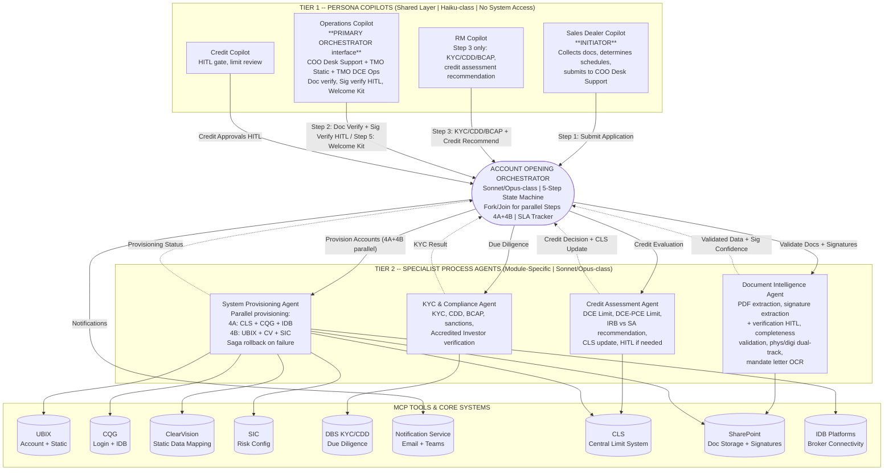
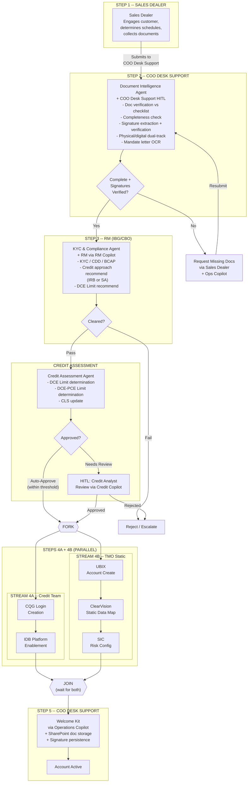

# Account Opening — Hybrid Agent Architecture

## DCE Hub, DBS Bank Singapore

**Document Type:** Module-Specific Agentic Architecture Design
**Audience:** DCE Head, GFM Leadership, CTO Office, Enterprise Architecture
**Classification:** Internal — Confidential
**Version:** 2.0 | February 2026
**Prepared for:** DCE Agentic Transformation Program
**Prerequisite Reading:** Enterprise Agentic Architecture (7-Plane), DCE Current Situation Analysis, Agent Architecture Style Analysis

> **v2.0 NOTICE:** This version corrects 6 critical errors identified in v1.0. See [Section 11: Change Log](#11-change-log) for a complete list of corrections. Key changes: Sales Dealer is the initiator (not RM), COO Desk Support is the primary human orchestrator (was entirely missing), workflow corrected to 5 steps with parallel fork/join, Document Intelligence Agent scope corrected, systems list updated.

---

## 1. Why Account Opening First

Account Opening is the highest-impact, highest-pain process in DCE:

| Factor | Detail |
|---|---|
| **Current duration** | 3-15 working days |
| **Competitor benchmark** | 1-3 working days (Goldman, JPM, BNP) |
| **Volume** | 15-20 new accounts per month |
| **Personas involved** | 7 of 10 (highest coordination complexity) |
| **Systems touched** | 8 (UBIX, CQG, CLS, SIC, CV, IDB Platforms, SharePoint, DBS KYC/CDD). Murex MX.3: TBC -- not confirmed for Account Opening scope. |
| **Revenue impact** | Delayed onboarding = delayed trading = delayed commission |
| **Competitive risk** | A corporate treasurer who can open with Goldman in 2 days will not wait 15 days for DBS |
| **Coordination model** | No workflow system exists today. Entire process is email-driven. COO Desk Support is the single human orchestrator tracking all streams manually via Excel and SharePoint. |
| **Pipeline boundary** | Pipeline Management's LAST STEP produces Document Checklist. Account Opening begins immediately after. Future state: auto-generated checklist from customer requirements data. |

Building the hybrid agent architecture for Account Opening first proves the pattern before expanding to other modules.

---

## 2. Agent Inventory -- Account Opening Module

### Total Agent Count: 9

| Tier | Agent | Count |
|---|---|---|
| **Tier 1 -- Persona Copilots** (shared across all modules) | Sales Dealer Copilot, RM Copilot, Operations Copilot, Credit Copilot | **4** |
| **Tier 2 -- Process Agents** (module-specific) | Account Opening Orchestrator, Document Intelligence Agent, KYC & Compliance Agent, Credit Assessment Agent, System Provisioning Agent | **5** |
| **Total** | | **9** |

**Key distinction:** The 4 persona copilots are shared infrastructure -- built once, used by all future modules. The 5 process agents are specific to Account Opening. When expanding to other modules (Margin Calls, Reconciliation, etc.), you add new process agents but reuse the same persona copilots.

**v2.0 Role Corrections:**

| Agent | v1.0 Role | v2.0 Corrected Role |
|---|---|---|
| **Sales Dealer Copilot** | Pipeline handoff only | **INITIATOR.** Collects docs, determines schedules, submits application to COO Desk Support. First touchpoint in Account Opening. |
| **RM Copilot** | Initiator of account opening | **Step 3 only.** KYC/CDD/BCAP tracking, credit assessment recommendation. Not the initiator. |
| **Operations Copilot** | Generic operations tasks | **PRIMARY ORCHESTRATOR interface.** Serves COO Desk Support (the real human orchestrator): doc verification, signature verification HITL, physical copy tracking, coordinates all teams, Welcome Kit dispatch. Also serves TMO Static and TMO DCE Ops. |
| **Credit Copilot** | Same | Same. HITL for credit decisions, limit review. |

---

## 3. Architecture Diagram -- Hybrid Two-Tier

```
TRUST PLANE (Continuous Security Envelope -- wraps everything below)
========================================================================================

  TIER 1 -- PERSONA COPILOTS (Shared Layer)
  Model: Haiku-class | System Access: NONE | Role: Intent + Context + UX
  +---------------------------------------------------------------------+
  |                                                                     |
  |  +--------------+  +--------------+  +--------------+  +---------+ |
  |  | Sales Dealer |  |  RM Copilot  |  |  Operations  |  | Credit  | |
  |  |   Copilot    |  |              |  |   Copilot    |  | Copilot | |
  |  |              |  |              |  |              |  |         | |
  |  | - INITIATOR  |  | - Step 3     |  | - PRIMARY    |  | - HITL  | |
  |  | - Collects   |  |   only       |  |   ORCH       |  |   gate  | |
  |  |   docs       |  | - KYC/CDD   |  |   interface  |  | - Limit | |
  |  | - Determines |  |   /BCAP      |  | - Doc verify |  |   review| |
  |  |   schedules  |  |   tracking   |  | - Sig verify |  |         | |
  |  | - Submits to |  | - Credit     |  |   (HITL)     |  |         | |
  |  |   COO Desk   |  |   assessment |  | - Physical   |  |         | |
  |  |   Support    |  |   recommend  |  |   copy track |  |         | |
  |  |              |  |              |  | - Welcome Kit|  |         | |
  |  +------+-------+  +------+-------+  +------+-------+  +----+----+ |
  |         |                 |                  |               |     |
  +---------+-----------------+------------------+---------------+-----+
            |                 |                  |               |
            +--------+--------+------------------+               |
                     |                                           |
                     v                                           |
  +=====================================================================+
  ||            ACCOUNT OPENING ORCHESTRATOR                           ||
  ||            Sonnet/Opus-class | Workflow State Machine              ||
  ||                                                                    ||
  ||  Responsibilities:                                                 ||
  ||  - End-to-end workflow management (5-step state machine)           ||
  ||  - FORK/JOIN for parallel Steps 4A + 4B                           ||
  ||  - SLA tracking and escalation                                     ||
  ||  - Task routing to specialist agents                               ||
  ||  - Status aggregation for persona copilots                         ||
  ||  - Notification dispatch                                           ||
  ||  - Audit trail ownership (authoritative record)                    ||
  +============+============+============+============+=================+
               |            |            |            |
               v            v            v            v

  TIER 2 -- SPECIALIST PROCESS AGENTS (Module-Specific)
  Model: Sonnet/Opus-class | System Access: Scoped per agent
  +---------------------------------------------------------------------+
  |                                                                     |
  |  +--------------+  +--------------+  +--------------+  +---------+ |
  |  |  Document    |  | KYC &        |  | Credit       |  | System  | |
  |  |  Intelligence|  | Compliance   |  | Assessment   |  |Provision| |
  |  |  Agent       |  | Agent        |  | Agent        |  |  Agent  | |
  |  |              |  |              |  |              |  |         | |
  |  | - PDF extract|  | - KYC verify |  | - DCE Limit  |  | - UBIX  | |
  |  | - Sig extract|  | - CDD/BCAP   |  | - DCE-PCE    |  | - CLS   | |
  |  |   & verify   |  | - Sanctions  |  |   Limit      |  | - CQG   | |
  |  |   (HITL)     |  | - Accredited |  | - IRB vs SA  |  | - CV    | |
  |  | - Complete-  |  |   Investor   |  |   recommend  |  | - SIC   | |
  |  |   ness check |  |   check      |  | - CLS update |  | - IDB   | |
  |  | - Phys/Digi  |  |              |  | - HITL if    |  | - Share-| |
  |  |   dual track |  |              |  |   needed     |  |   Point | |
  |  | - Mandate    |  |              |  |              |  | - Saga  | |
  |  |   letter OCR |  |              |  |              |  | rollback| |
  |  +------+-------+  +------+-------+  +------+-------+  +----+----+ |
  |         |                 |                  |               |     |
  +---------+-----------------+------------------+---------------+-----+
            |                 |                  |               |
            v                 v                  v               v

  CORE SYSTEMS (via MCP Tools)
  +---------------------------------------------------------------------+
  | +------+ +------+ +------+ +--------+ +-----+ +-------+ +--------+ |
  | | UBIX | |  CQG | |  CLS | |Clear-  | | SIC | |  DBS  | | Share- | |
  | |      | |      | |      | | Vision | |     | |KYC/CDD| | Point  | |
  | |Acct  | |Login+| |Limit | |Static  | |Risk | |Due    | |Doc     | |
  | |Create| | IDB  | |Update| |Data Map| |Cfg  | |Diligce| |Storage | |
  | +------+ +------+ +------+ +--------+ +-----+ +-------+ +--------+ |
  |                                                                     |
  | +--------+                                                          |
  | |  IDB   |   Murex MX.3: TBC -- not confirmed for Account Opening  |
  | |Platforms|                                                         |
  | +--------+                                                          |
  +---------------------------------------------------------------------+

========================================================================================
OBSERVABILITY PLANE (Spans all tiers -- tracing, evaluation, cost accounting)
```

### Mermaid Diagram (Interactive)



---

## 4. Agent Specifications

### 4.1 Tier 1 -- Persona Copilots

These are **thin, shared copilots** that serve as the user interaction layer. They have **ZERO direct system access** -- they can only invoke process agents through the Orchestrator.

#### Sales Dealer Copilot

| Attribute | Specification |
|---|---|
| **Serves** | FO Sales Dealers -- 8-10 people |
| **Model** | Haiku-class (fast, cost-efficient) |
| **Role in Account Opening** | **INITIATOR (Step 1).** Engages customer, determines applicable document schedules based on product needs, guides customer through filling documents, collects all documents, submits complete application package to COO Desk Support via Orchestrator. This is the first touchpoint in Account Opening. |
| **System access** | NONE |
| **Can invoke** | Account Opening Orchestrator (initiate, submit application, query status) |
| **Memory** | Dealer's pipeline, client relationships, commission agreements, document schedule determination history, customer product requirements |
| **Autonomy level** | Level 3 (instruction-guided) |
| **v2.0 change** | UPGRADED from pipeline handoff to INITIATOR. Schedule determination is the Sales Dealer's manual job in current state -- the copilot assists but does not replace this judgment. |

#### RM Copilot

| Attribute | Specification |
|---|---|
| **Serves** | Relationship Managers (IBG, CBO) -- 8-10 people |
| **Model** | Haiku-class (fast, cost-efficient) |
| **Role in Account Opening** | **Step 3 only.** Conducts KYC, CDD clearance, BCAP clearance, recommends Credit Assessment Approach (IRB or SA), recommends DCE Limit and DCE-PCE Limit. Does NOT initiate account opening. |
| **System access** | NONE |
| **Can invoke** | Account Opening Orchestrator (Step 3 tasks, query status) |
| **Memory** | RM's client portfolio, KYC/CDD history, preferred communication patterns, credit assessment approach preferences |
| **Autonomy level** | Level 3 (instruction-guided) |
| **v2.0 change** | DOWNGRADED from initiator to Step 3 participant only. RM is not the first touchpoint -- Sales Dealer is. |

#### Operations Copilot

| Attribute | Specification |
|---|---|
| **Serves** | COO Desk Support (5-7), COO Client Services (5-7), TMO Static Team (4-5), TMO DCE Ops (5-7) -- consolidated copilot for ~20 operational staff |
| **Model** | Haiku-class |
| **Role in Account Opening** | **PRIMARY ORCHESTRATOR interface.** COO Desk Support is the real human orchestrator of the account opening process. This copilot serves them for: (Step 2) document verification against checklist, completeness verification, signature verification with HITL mandatory confidence scoring, signing authority confirmation against company mandate, physical copy tracking. (Step 5) Welcome Kit dispatch once Steps 4A + 4B are both complete. Also surfaces TMO Static tasks (Step 4B: UBIX, CV, SIC) and TMO DCE Ops tasks. |
| **System access** | NONE |
| **Can invoke** | Account Opening Orchestrator (Step 2 tasks, Step 5 tasks, status, updates, signature verification HITL decisions) |
| **Memory** | Task queue, operational preferences, shift handover context, physical copy tracking state, signature verification history |
| **Autonomy level** | Level 3 |
| **Design note** | Consolidates 4 operations personas into one copilot because their Account Opening tasks are sequential and complementary. The copilot surfaces the right tasks to the right sub-persona based on their role tag. COO Desk Support sees doc verification + signature HITL + Welcome Kit tasks. TMO Static sees UBIX/CV/SIC setup tasks. TMO DCE Ops sees operational readiness tasks. |
| **v2.0 change** | UPGRADED. Now explicitly the PRIMARY ORCHESTRATOR interface, reflecting COO Desk Support's real role as the human who coordinates all teams. Added signature verification HITL, physical copy tracking, and Welcome Kit dispatch. |

#### Credit Copilot

| Attribute | Specification |
|---|---|
| **Serves** | Credit team -- 5-6 people |
| **Model** | Haiku-class |
| **Role in Account Opening** | HITL approval gate for credit decisions. Review DCE Limit and DCE-PCE Limit recommendations. Approve/reject with rationale. Monitor CLS updates. |
| **System access** | NONE |
| **Can invoke** | Account Opening Orchestrator (approvals), Credit Assessment Agent (direct queries for ad-hoc credit analysis) |
| **Memory** | Approval history, credit policy preferences, pending approval queue |
| **Autonomy level** | Level 4 (hybrid -- deterministic approval framework with judgment overlay) |

---

### 4.2 Account Opening Orchestrator

This is the **central brain** of the Account Opening module. It combines the Supervisor pattern with workflow state management. The state machine is reworked in v2.0 to match the correct 5-step workflow with a FORK/JOIN pattern for parallel Steps 4A and 4B.

| Attribute | Specification |
|---|---|
| **Model** | Sonnet/Opus-class (complex reasoning for workflow decisions) |
| **Autonomy level** | Level 4 (deterministic workflow with LLM judgment at decision points) |
| **System access** | Notification Service only (email, Teams). No direct access to core systems. |
| **Can invoke** | All 4 specialist process agents + Notification Service |

**State Machine:**

```
ACCOUNT OPENING WORKFLOW STATES (v2.0 — 5-Step with Fork/Join)
================================================================

[1] APPLICATION_SUBMITTED
    Trigger: Sales Dealer Copilot submits application package
             (Sales Dealer has collected docs, determined schedules,
              guided customer through filling documents)
    Actions: Create workflow instance, assign correlation ID, start SLA timer,
             log document schedule determination by Sales Dealer,
             notify Operations Copilot (COO Desk Support) of new application
    Next: -> DOCUMENT_VERIFICATION

[2] DOCUMENT_VERIFICATION
    Agent: Document Intelligence Agent
    Human: COO Desk Support (via Operations Copilot)
    Actions:
      - Extract PDF form data, validate fields against already-determined schedules
      - Check completeness against document checklist
      - Extract signatures from documents
      - Verify signatures against signatory's ID document (confidence scoring)
      - Confirm signing authority against company mandate
      - Track physical/digital dual-status per document
      - Extract Authorised Trader details from mandate letter (OCR)
      - HITL: COO Desk Support reviews signature verification results,
              makes final approval decision on signature match
    Decision gate:
      Complete + Signatures verified -> COMPLIANCE_KYC
      Incomplete -> PENDING_DOCUMENTS (request missing info)
      Signature mismatch -> SIGNATURE_REVIEW (escalate to COO Desk Support)
    SLA: 4 hours (automated extraction), 24 hours (with HITL signature review)

[3] PENDING_DOCUMENTS
    Trigger: Missing documents, incomplete form, or failed signature verification
    Actions: Generate specific request list, notify Sales Dealer Copilot
             and/or Operations Copilot to coordinate with customer
    Decision gate:
      Customer responds -> DOCUMENT_VERIFICATION (re-validate)
      SLA breach (48h) -> Escalate to Sales Dealer Copilot + Operations Copilot
    Note: Physical copy status tracked separately -- not a hard gate to proceed

[4] SIGNATURE_REVIEW
    Trigger: Signature verification confidence below threshold
    Actions: Push signature comparison (extracted signature vs ID document)
             with confidence score to Operations Copilot for COO Desk Support
    Decision gate:
      COO Desk Support approves -> COMPLIANCE_KYC
      COO Desk Support rejects -> PENDING_DOCUMENTS (request re-signed docs)
    HITL level: HIGH (mandatory -- "AI assists, human decides" is non-negotiable)

[5] COMPLIANCE_KYC
    Agent: KYC & Compliance Agent
    Human: RM (via RM Copilot)
    Actions:
      - RM conducts KYC
      - CDD clearance
      - BCAP clearance
      - RM recommends Credit Assessment Approach (IRB or SA)
      - RM recommends DCE Limit / DCE-PCE Limit
      - Sanctions screening
      - Accredited Investor verification (if LME -- Schedule 8A)
    Decision gate:
      Cleared + Credit approach recommended -> CREDIT_ASSESSMENT
      Failed -> REJECTED (with reason)
      Needs review -> HITL escalation to compliance officer
    SLA: 24 hours

[6] CREDIT_ASSESSMENT
    Agent: Credit Assessment Agent
    Actions:
      - Evaluate credit based on RM's recommended approach (IRB or SA)
      - Determine DCE Limit + DCE-PCE Limit
      - Update CLS (Central Limit System)
    Decision gate:
      Auto-approve (within pre-approved thresholds) -> PARALLEL_PROVISIONING
      Needs HITL -> CREDIT_APPROVAL_PENDING
      Rejected -> REJECTED (with reason)
    SLA: 24 hours (auto), 48 hours (HITL)

[7] CREDIT_APPROVAL_PENDING
    Trigger: Credit decision requires human review
    Actions: Push approval request to Credit Copilot with full context
             (recommendation, rationale, risk assessment, IRB/SA approach)
    Decision gate:
      Approved -> PARALLEL_PROVISIONING
      Rejected -> REJECTED
      Timeout (48h) -> Escalate to senior credit officer
    HITL level: HIGH (async review, 4h initial SLA)

[8] PARALLEL_PROVISIONING  <<<--- FORK STATE
    Trigger: Credit assessment approved (auto or HITL)
    Actions: FORK into two parallel streams:

    STREAM 4A — Credit Team Provisioning:
      - Create CQG login
      - Enable IDB platforms
      - (CLS already updated in Credit Assessment step)

    STREAM 4B — TMO Static Provisioning:
      - Create account in UBIX
      - Update static data in CV (ClearVision)
      - Map to SIC

    Execution: Both streams run in PARALLEL
    Each stream uses saga pattern for rollback on failure

    Decision gate:
      Both 4A AND 4B complete -> JOIN -> WELCOME_KIT
      Either stream fails -> Saga rollback + PROVISIONING_FAILED
    SLA: 4 hours per stream

[9] PROVISIONING_FAILED
    Trigger: One or more provisioning steps failed in either stream
    Actions: Execute saga compensating actions (rollback completed steps),
             log failure, alert Operations Copilot and Tech Support
    Next: Manual investigation -> retry PARALLEL_PROVISIONING

[10] WELCOME_KIT  <<<--- JOIN STATE
     Trigger: Both Stream 4A and Stream 4B completed successfully
     Human: COO Desk Support (via Operations Copilot)
     Actions:
       - COO Desk Support sends Welcome Kit to customer
       - Store all documents and verified signatures in SharePoint
       - Verified signatures persisted for future reuse
         (Funds Withdrawal, Authorised Traders verification)
       - Push completion status to all participating persona copilots
       - Close SLA timer, archive audit trail
     Notification: Customer via Welcome Kit, Sales Dealer Copilot,
                   RM Copilot, Operations Copilot

[11] COMPLETED
     Actions: Archive full audit trail, mark account as active,
              persist signature records for future reuse
     Notification: All participating copilots

[12] REJECTED
     Trigger: KYC failure, credit rejection, or policy violation
     Actions: Generate rejection notification with reason,
              notify Sales Dealer Copilot and RM Copilot,
              archive audit trail with full rejection rationale
```

**State Machine -- Fork/Join Detail:**

```
                    CREDIT_ASSESSMENT
                          |
                    [Approved]
                          |
                   PARALLEL_PROVISIONING
                     /           \
                    /             \
          STREAM 4A              STREAM 4B
     (Credit Team)           (TMO Static)
     +-----------+           +-----------+
     | CQG Login |           | UBIX Acct |
     | IDB Enable|           | CV Update |
     | (CLS done)|           | SIC Map   |
     +-----------+           +-----------+
                    \             /
                     \           /
                    JOIN (both must complete)
                          |
                     WELCOME_KIT
                   (COO Desk Support)
```

**SLA Tracking:**

| Stage | Target SLA | Escalation |
|---|---|---|
| Document Verification (automated extraction) | 4 hours | Alert Ops Copilot if stuck |
| Document Verification (HITL signature review) | 24 hours | Alert COO Desk Support + senior ops |
| Pending Documents (customer resubmission) | 48 hours | Alert Sales Dealer + Ops Copilot |
| Compliance / KYC (RM Step 3) | 24 hours | Escalate to RM head |
| Credit Assessment (auto) | 24 hours | Alert Credit Copilot |
| Credit Assessment (HITL) | 48 hours | Escalate to senior credit officer |
| Parallel Provisioning (per stream) | 4 hours | Alert Ops Copilot + Tech Support |
| Welcome Kit dispatch | 4 hours | Alert COO Desk Support |
| **End-to-End Target** | **3 working days** | **Escalate to DCE Head if breached** |

---

### 4.3 Tier 2 -- Specialist Process Agents

#### Document Intelligence Agent

| Attribute | Specification |
|---|---|
| **Model** | Sonnet-class (document understanding + structured extraction) |
| **Autonomy level** | Level 5 (deterministic extraction with LLM for unstructured fields) |
| **System access** | Read-only: Document storage (scanned PDFs), SharePoint (soft copies, signatures) |
| **Trust level** | Medium-High (read-only for extraction, but signature verification requires HITL) |
| **v2.0 changes** | REMOVED: "dynamic schedule determination" (that is Sales Dealer's manual job). ADDED: signature extraction + verification with confidence scoring, physical/digital dual-status tracking, mandate letter OCR for Authorised Traders. |

**Capabilities:**

```
DOCUMENT INTELLIGENCE AGENT (v2.0)
====================================

INPUT:  Scanned PDF of DCE Corporate/Institution Application Form (31 pages)
        + Supporting documents (ID proofs, GTA, mandate letters, etc.)
        + Document schedule list (determined by Sales Dealer in Step 1)

PROCESSING:

  1. PDF EXTRACTION
     - OCR if scanned image (Tesseract/Azure Document Intelligence)
     - Structured field extraction for all form sections
     - Corporate Information: name, address, registration, tax residence
     - Account Relationship Details: existing accounts, shareholding
     - Customer Declaration: signature extraction

  2. COMPLETENESS VALIDATION (against Sales Dealer's determined schedules)
     NOTE: Schedule determination is the Sales Dealer's job (Step 1).
     This agent validates completeness AGAINST the already-determined
     schedule list -- it does NOT determine which schedules are needed.

     Mandatory schedules (all customers): 1, 2, 3, 4, 5, 10, 11A, 12
     Conditional schedules (as determined by Sales Dealer): 7A, 8A, 9

     For each required schedule:
       - Present? (Y/N)
       - Signed? (Y/N)
       - All fields completed? (Y/N)
       - Company stamp present? (Y/N, if applicable)

     Additional Non-Schedule Documents:
       - ID Proofs (Identification Documents, Residential Proofs)
       - GTA (General Trading Agreement) + GTA-Addendum (if applicable)
       - Account Opening Form + Terms & Conditions
       - CDD Clearance Doc
       - BCAP Clearance
       - ACRA / Certificate of Incumbency
       - Minimum 2 Key Directors ID
       - UBO / Guarantor ID

     For supporting documents:
       - Corporate Resolutions (original or certified)? (Y/N)
       - Letter of Appointment of Authorised Traders? (Y/N)
       - Specimen Signatures? (Y/N)
       - Certification valid? (DBS staff, solicitor, notary, etc.)

  3. SIGNATURE EXTRACTION & VERIFICATION (NEW in v2.0)
     - Extract signature images from all signed documents
     - Extract signatory name and role from document context
     - Compare extracted signature against signatory's ID document
     - Generate confidence score (0.0-1.0) for each signature match
     - Flag signatures below confidence threshold for HITL review
     - Verify signing authority against company mandate

     CRITICAL DESIGN PRINCIPLE:
       "AI assists, human decides" -- this is NON-NEGOTIABLE.
       The agent presents match accuracy/confidence score.
       COO Desk Support (via Operations Copilot) makes final approval.
       No signature is considered verified without human sign-off.

     Signature persistence:
       - Verified signatures are stored linked to customer profile
       - These signatures are REUSED for future verification:
         * Funds Withdrawal instruction verification
         * Authorised Traders mandate letter verification

  4. PHYSICAL / DIGITAL DUAL-STATUS TRACKING (NEW in v2.0)
     Each document is tracked with TWO independent statuses:

     | Status Type    | Values              |
     |----------------|---------------------|
     | Digital Status | Pending / Updated   |
     | Physical Copy  | Pending / Received  |

     Processing begins on digital copies.
     Physical originals are tracked separately by COO Desk Support.
     Physical copies are NOT a hard gate to account go-live.
     Physical copies are a compliance obligation tracked to completion.

  5. MANDATE LETTER OCR -- AUTHORISED TRADERS (NEW in v2.0)
     - Customer submits mandate letter listing authorised traders
     - OCR extraction of trader details:
       * Full Name
       * ID No. / Passport No.
       * Designation
       * Onboarding Status
     - Signature on mandate letter verified against authorised
       company signatories (uses signature verification from step 3)

  6. DATA QUALITY CHECKS
     - Tax residence country valid?
     - Registration number format valid?
     - Schedule 12 bank accounts: max 3 DBS/POSB + max 3 third-party
     - Schedule 8A LEI format valid? (if LME)
     - No contradictions between sections

OUTPUT: Structured extraction result
  {
    corporate_info: { ... },
    service_selections: [ ... ],
    required_schedules: [ ... ],  // as determined by Sales Dealer
    schedules_present: { schedule_id: { present, signed, complete } },
    supporting_docs: { ... },
    additional_non_schedule_docs: {
      id_proofs: { present, verified },
      gta: { present, addendum_required, addendum_present },
      account_opening_form: { present, complete },
      cdd_clearance: { present },
      bcap_clearance: { present },
      acra_cert: { present },
      directors_id: { count, minimum_met },
      ubo_guarantor_id: { present }
    },
    completeness_score: 0.0-1.0,
    missing_items: [ { item, schedule, description } ],
    signatures: {
      extracted: [ { signatory, role, document, image_ref } ],
      verification_results: [
        {
          signatory: string,
          confidence: 0.0-1.0,
          id_document_ref: string,
          hitl_required: boolean,
          hitl_decision: PENDING | APPROVED | REJECTED
        }
      ]
    },
    physical_digital_status: {
      document_id: {
        digital_status: PENDING | UPDATED,
        physical_status: PENDING | RECEIVED
      }
    },
    authorised_traders: [
      { full_name, id_number, designation, onboarding_status }
    ],
    data_quality_flags: [ ... ],
    confidence: 0.0-1.0
  }
```

#### KYC & Compliance Agent

| Attribute | Specification |
|---|---|
| **Model** | Sonnet-class |
| **Autonomy level** | Level 4 (deterministic checks with LLM for edge cases) |
| **System access** | DBS KYC/CDD systems (read + write verification results) |
| **Trust level** | High (compliance decisions, access to sensitive identity data) |
| **HITL** | Auto-clear standard cases; escalate edge cases to compliance officer |

**Capabilities:**

```
KYC & COMPLIANCE AGENT
========================

INPUT:  Extracted customer data from Document Intelligence Agent
        + RM's KYC/CDD/BCAP clearance results (from Step 3)
        + RM's Credit Assessment Approach recommendation (IRB or SA)

PROCESSING:
  1. KYC VERIFICATION
     - Customer identity verification against DBS internal records
     - Corporate registration verification
     - Beneficial ownership identification (10%+ shareholders per form Section 2)
     - PEP (Politically Exposed Person) screening

  2. CDD (Customer Due Diligence)
     - Risk classification (low/medium/high)
     - Source of funds assessment
     - Nature of business verification

  3. BCAP (Business Conduct and Accountability Programme)
     - DBS internal customer assessment
     - Existing relationship check

  4. SANCTIONS SCREENING
     - OFAC, EU, UN, MAS sanctions lists
     - Real-time screening against current lists

  5. ACCREDITED INVESTOR VERIFICATION (if LME trading -- Schedule 8A)
     - Verify Accredited Investor status per SFA
     - Document evidence of qualification

  6. EXISTING ACCOUNT CROSS-CHECK
     - Check for existing DCE accounts (per form Section 2)
     - Identify related entities with existing accounts

OUTPUT:
  {
    kyc_status: CLEARED | FAILED | REVIEW_REQUIRED,
    cdd_risk_rating: LOW | MEDIUM | HIGH,
    bcap_status: CLEARED | REVIEW_REQUIRED,
    sanctions_result: CLEAR | MATCH | POTENTIAL_MATCH,
    accredited_investor: VERIFIED | NOT_REQUIRED | FAILED,
    credit_approach_recommendation: IRB | SA,
    dce_limit_recommendation: { currency, amount },
    dce_pce_limit_recommendation: { currency, amount },
    flags: [ ... ],
    confidence: 0.0-1.0,
    evidence: [ { check, result, source, timestamp } ]
  }
```

#### Credit Assessment Agent

| Attribute | Specification |
|---|---|
| **Model** | Opus-class (complex financial reasoning) |
| **Autonomy level** | Level 4 (deterministic framework with LLM for qualitative overlay) |
| **System access** | UBIX (read: existing limits, account data), CLS (write: limit updates) |
| **Trust level** | Critical (credit decisions directly impact bank's risk exposure) |
| **HITL** | Auto-approve within pre-approved thresholds; HITL for all others |
| **v2.0 changes** | ADDED: CLS (Central Limit System) updates for DCE Limit + DCE-PCE Limit. REMOVED: CQG login creation and IDB enablement (those are Credit team's operational tasks in Step 4A, handled by System Provisioning Agent). |

**Capabilities:**

```
CREDIT ASSESSMENT AGENT (v2.0)
================================

INPUT:  KYC result + RM's credit assessment recommendation
        (IRB or SA approach) + DCE Limit / DCE-PCE Limit recommendation

PROCESSING:
  1. CREDIT EVALUATION
     - Assess customer creditworthiness using RM-recommended approach
       (IRB: Internal Ratings-Based, or SA: Standardised Approach)
     - Review existing credit facilities (if any)
     - Evaluate requested product risk profile

  2. DCE LIMIT + DCE-PCE LIMIT DETERMINATION
     - Determine DCE Limit based on: customer profile, products requested,
       risk rating, RM recommendation
     - Determine DCE-PCE Limit (Pre-agreed Credit Exposure)
     - Apply bank's credit policy framework

  3. AUTO-APPROVAL CHECK
     Pre-approved threshold rules:
       - Customer risk rating: LOW or MEDIUM
       - Requested limits: within standard bands
       - Products: standard listed futures/options only
       - No LME or deliverable contracts
     If ALL conditions met -> auto-approve (logged, next-day review)
     If ANY condition fails -> route to HITL (Credit Copilot)

  4. CLS UPDATE (NEW in v2.0)
     - Update Central Limit System with approved DCE Limit
     - Update Central Limit System with approved DCE-PCE Limit
     - Log all limit updates with full audit trail

  NOTE: CQG login creation and IDB platform enablement are NOT
  performed by this agent. Those are Credit team operational tasks
  executed in Step 4A via the System Provisioning Agent.

OUTPUT:
  {
    credit_decision: APPROVED | REJECTED | PENDING_HITL,
    credit_approach_used: IRB | SA,
    dce_limit: { currency, amount, rationale },
    dce_pce_limit: { currency, amount, rationale },
    auto_approved: boolean,
    hitl_required: boolean,
    hitl_context: { recommendation, rationale, risk_factors },
    cls_update: { updated: boolean, limit_ids: [...] },
    confidence: 0.0-1.0
  }
```

#### System Provisioning Agent

| Attribute | Specification |
|---|---|
| **Model** | Sonnet-class |
| **Autonomy level** | Level 5 (deterministic -- execute provisioning steps per approved configuration) |
| **System access** | WRITE access to: UBIX, CQG, CLS, ClearVision (CV), SIC, IDB Platforms, SharePoint. Murex MX.3: TBC -- not confirmed for Account Opening scope. |
| **Trust level** | Critical (write operations across multiple production systems) |
| **HITL** | No HITL (by this stage, all approvals are complete). Rollback on failure. |
| **v2.0 changes** | REMOVED: Murex (not confirmed for Account Opening). ADDED: CLS, SharePoint, IDB Platforms. REWORKED: Parallel execution model -- Stream 4A (Credit team systems) and Stream 4B (TMO Static systems) run in parallel via fork/join. |

**Capabilities:**

```
SYSTEM PROVISIONING AGENT (v2.0)
===================================

INPUT:  Approved customer profile + credit decision + product configuration
        + CLS limits (already set by Credit Assessment Agent)

PROCESSING (Fork/Join Pattern -- two parallel streams):

  ====== STREAM 4A: Credit Team Provisioning ======
  (Runs in PARALLEL with Stream 4B)

  Step 4A-1: CQG Login Creation
    Action:  Create customer login in CQG platform
             Configure market data access per product selection
    Compensate: Deactivate CQG login

  Step 4A-2: IDB Platform Enablement (if applicable)
    Action:  Enable Inter-Dealer Broker connectivity per customer request
             Configure across applicable IDB platforms
    Compensate: Disable IDB connectivity

  Note: CLS update is already complete (done in Credit Assessment step).
        CLS limits are verified here but not re-created.

  ====== STREAM 4B: TMO Static Provisioning ======
  (Runs in PARALLEL with Stream 4A)

  Step 4B-1: UBIX Account Creation
    Action:  Create customer account in UBIX
             Set up static data (customer info, product enablement)
    Compensate: Delete account from UBIX

  Step 4B-2: ClearVision (CV) Static Data Mapping
    Action:  Create static data mapping in ClearVision
             Link to UBIX account
    Compensate: Remove ClearVision mapping

  Step 4B-3: SIC Risk Configuration
    Action:  Configure account in SIC for real-time risk monitoring
             Set margin parameters per product selection
    Compensate: Remove SIC configuration

  ====== POST-JOIN: Document Storage ======
  (After both streams complete)

  Step 5-1: SharePoint Document Storage
    Action:  Store all verified documents in SharePoint
             Store verified signatures linked to customer profile
             for future reuse (Funds Withdrawal, Authorised Traders)

EXECUTION MODE:
  Stream 4A (CQG + IDB): Runs in parallel
  Stream 4B (UBIX + CV + SIC): Sequential within stream
                                (CV depends on UBIX account ID,
                                 SIC depends on UBIX account ID)
  Streams 4A and 4B: PARALLEL (independent of each other)
  Post-join: Sequential (depends on both streams completing)

FAILURE HANDLING (Saga Pattern):
  If any step within a stream fails:
    1. Execute compensating actions for all completed steps in THAT
       stream (reverse order)
    2. Signal the other stream to halt (if still running) or
       execute its compensating actions (if completed)
    3. Log failure with full context (which step, what error,
       what was rolled back)
    4. Return PROVISIONING_FAILED to Orchestrator
    5. Orchestrator alerts Operations Copilot + Tech Support

OUTPUT:
  {
    status: COMPLETED | FAILED,
    stream_4a: {
      cqg: { login_id, status },
      idb: { enabled: boolean, platforms: [...], status }
    },
    stream_4b: {
      ubix: { account_id, status },
      clearvision: { mapping_id, status },
      sic: { config_id, status }
    },
    sharepoint: {
      documents_stored: boolean,
      signatures_persisted: boolean,
      folder_ref: string
    },
    failed_step: (if failed) { stream, step, error,
                               compensating_actions_executed },
    duration_ms: number
  }
```

---

## 5. Workflow Diagram -- End-to-End



---

## 6. Persona-to-Agent Authorization Matrix

Which persona copilots can invoke which process agents for Account Opening:

| Persona Copilot | Orchestrator | Document Intelligence | KYC & Compliance | Credit Assessment | System Provisioning |
|---|:---:|:---:|:---:|:---:|:---:|
| **Sales Dealer Copilot** | Initiate (Step 1), Query Status | - | - | - | - |
| **RM Copilot** | Step 3 Tasks, Query Status | - | - | - | - |
| **Operations Copilot** | Step 2 Tasks (Doc Verify, Sig HITL), Step 5 (Welcome Kit), Status, Updates | - | - | - | - |
| **Credit Copilot** | Credit Approvals (HITL) | - | - | Query (ad-hoc) | - |

**Key principles:**

1. Persona copilots **never** invoke specialist agents directly (except Credit Copilot -> Credit Assessment Agent for ad-hoc queries). All routing goes through the Orchestrator. This maintains a single audit trail and prevents bypassing workflow steps.

2. **Sales Dealer Copilot** is the ONLY copilot authorized to initiate a new account opening workflow (Step 1).

3. **Operations Copilot** is the primary interface for COO Desk Support, who is the human orchestrator. It has the broadest Orchestrator interaction surface: document verification tasks, signature verification HITL decisions, physical copy tracking, and Welcome Kit dispatch.

4. **RM Copilot** can only interact with the Orchestrator for Step 3 tasks -- it cannot initiate or close an account opening.

---

## 7. Trust & HITL Configuration

| Agent | Trust Level | HITL Requirement | Data Classification |
|---|---|---|---|
| Persona Copilots (all) | Low | N/A (interaction layer only) | No direct data access |
| Account Opening Orchestrator | High | Escalation on SLA breach | Workflow state (Internal) |
| Document Intelligence Agent | Medium-High | **Signature verification: MANDATORY HITL** | Customer PII + Signatures (Confidential) |
| KYC & Compliance Agent | High | Edge cases only | Customer PII + Compliance (Restricted) |
| Credit Assessment Agent | Critical | All decisions above auto-threshold | Credit data (Restricted) |
| System Provisioning Agent | Critical | None (post-approval execution) | System credentials (Restricted) |

### HITL Approval Flow for Signature Verification (NEW in v2.0)

```
Document Intelligence Agent extracts signatures
  |
  +-- For each signature on each document:
  |
  +-- Step 1: Extract signature image from document
  |
  +-- Step 2: Extract reference signature from signatory's ID document
  |
  +-- Step 3: AI comparison generates confidence score (0.0-1.0)
  |
  +-- Step 4: Decision routing based on confidence:
  |
  |     Confidence >= 0.95:
  |       -> Flag as HIGH CONFIDENCE
  |       -> Still requires HITL confirmation (non-negotiable)
  |       -> Present to COO Desk Support with "Recommended: Approve"
  |
  |     Confidence 0.70-0.94:
  |       -> Flag as MEDIUM CONFIDENCE
  |       -> Requires HITL review with side-by-side comparison
  |       -> Present to COO Desk Support with detailed comparison
  |
  |     Confidence < 0.70:
  |       -> Flag as LOW CONFIDENCE
  |       -> Requires HITL with escalation recommendation
  |       -> Present to COO Desk Support with "Recommended: Reject/Re-sign"
  |
  +-- Step 5: COO Desk Support reviews via Operations Copilot:
  |     Option A: Approve signature (with optional notes)
  |     Option B: Reject signature (request re-signed document)
  |     Option C: Escalate to senior operations manager
  |
  +-- Step 6: Signing authority verification
  |     Confirm signatory is authorised per company mandate
  |     Cross-reference against mandate letter
  |
  +-- Step 7: On approval:
  |     -> Signature persisted to customer profile (SharePoint + linked record)
  |     -> Available for future reuse:
  |        * Funds Withdrawal verification
  |        * Authorised Traders mandate verification
  |     -> Orchestrator proceeds to next state
  |
  +-- On rejection:
        -> Orchestrator moves to PENDING_DOCUMENTS
        -> Specific re-signing request generated
```

### HITL Approval Flow for Credit Decisions

```
Credit Assessment Agent determines HITL required
  |
  +-- Checkpoint saved (full context + partial results)
  |
  +-- Approval request created:
  |     What: "DCE Limit of SGD 5M + DCE-PCE Limit of SGD 3M for Client X"
  |     Why:  "Exceeds standard auto-approval band (SGD 2M)"
  |     Approach: "IRB (as recommended by RM)"
  |     Data: Risk rating, exposure analysis, recommendation
  |     Suggested approver: Senior Credit Analyst (based on limit size)
  |
  +-- Pushed to Credit Copilot -> Credit Analyst's approval queue
  |
  +-- Credit Analyst reviews via Credit Copilot:
  |     Option A: Approve (with optional limit adjustment)
  |     Option B: Reject (with mandatory reason)
  |     Option C: Request more information
  |
  +-- On approval:
  |     -> CLS updated with final approved limits
  |     -> Orchestrator resumes from checkpoint -> PARALLEL_PROVISIONING
  +-- On rejection: Orchestrator moves to REJECTED state
  +-- On timeout (48h): Escalate to Head of Credit
```

---

## 8. Observability -- What Gets Traced

```
TRACE: Account Opening for Client X
  |
  +-- SPAN: Sales Dealer Copilot -> Application Submission (Step 1)
  |     Duration: 300ms, Model: Haiku, Tokens: 600
  |     Schedules determined by Sales Dealer: 1,2,3,4,5,7A,8A,10,11A,12
  |     Documents collected: 15 files
  |
  +-- SPAN: Orchestrator -> APPLICATION_SUBMITTED
  |     State: APPLICATION_SUBMITTED -> DOCUMENT_VERIFICATION
  |     SLA timer started: 3 working days
  |     COO Desk Support notified via Operations Copilot
  |
  +-- SPAN: Document Intelligence Agent (Step 2)
  |     Duration: 25s, Model: Sonnet, Tokens: 10,000
  |     Completeness: 92% (missing: Schedule 8A signature)
  |     Signatures extracted: 4
  |     Signature verification results:
  |       Director A: 0.97 confidence (HIGH)
  |       Director B: 0.82 confidence (MEDIUM)
  |     Physical/Digital status: 12 digital updated, 3 physical pending
  |     Authorised Traders extracted: 3 from mandate letter
  |
  +-- SPAN: Signature Verification HITL
  |     Pushed to Operations Copilot (COO Desk Support)
  |     Director A: Approved by COO Desk Support (2 min review)
  |     Director B: Approved by COO Desk Support (5 min review, side-by-side)
  |
  +-- SPAN: Orchestrator -> PENDING_DOCUMENTS
  |     Missing: Schedule 8A signature
  |     Notification sent via Sales Dealer Copilot
  |     Wait: 6 hours (customer responded)
  |
  +-- SPAN: Document Intelligence Agent (re-validation)
  |     Completeness: 100%
  |
  +-- SPAN: KYC & Compliance Agent (Step 3)
  |     Duration: 45s, Model: Sonnet, Tokens: 5,000
  |     RM conducted KYC/CDD/BCAP via RM Copilot
  |     KYC: CLEARED, CDD Risk: MEDIUM, Sanctions: CLEAR
  |     Accredited Investor: VERIFIED (LME trading -- Schedule 8A)
  |     Credit Approach Recommended: IRB
  |
  +-- SPAN: Credit Assessment Agent
  |     Duration: 30s, Model: Opus, Tokens: 12,000
  |     DCE Limit: SGD 3M, DCE-PCE Limit: SGD 2M
  |     Approach: IRB, Auto-approved: YES (within band)
  |     CLS Updated: YES (limit_ids: [CLS-2026-042, CLS-2026-043])
  |
  +-- SPAN: System Provisioning Agent (PARALLEL)
  |     Total Duration: 90s (parallel provisioning)
  |     |
  |     +-- STREAM 4A (Credit Team):
  |     |     CQG: Login created (login_id: CQG-DBS-1234) - 15s
  |     |     IDB: Enabled (platforms: [Tradition, Tullett]) - 20s
  |     |
  |     +-- STREAM 4B (TMO Static):
  |           UBIX: Created (account_id: DCE-2026-042) - 30s
  |           ClearVision: Mapped (mapping_id: CV-2026-042) - 25s
  |           SIC: Configured (config_id: SIC-2026-042) - 15s
  |
  +-- SPAN: JOIN -> Both streams complete
  |
  +-- SPAN: Welcome Kit (Step 5)
  |     COO Desk Support dispatched Welcome Kit via Operations Copilot
  |     SharePoint: Documents stored, signatures persisted
  |     Customer notification: Sent
  |
  +-- SPAN: Orchestrator -> COMPLETED
  |     Total duration: 1.5 working days
  |     SLA status: MET (target: 3 days)
  |     Notifications: Sales Dealer, RM, Operations, Customer
  |
  +-- COST SUMMARY
        Total tokens: 27,600
        Total cost: ~$0.50
        Models used: Haiku (copilots), Sonnet (extraction, KYC, provisioning),
                     Opus (credit assessment)
        HITL touchpoints: 2 (signature verification, none for credit -- auto-approved)
```

---

## 9. How This Scales to Other Modules

The Account Opening architecture establishes the pattern. Expanding to other modules:

| New Module | New Process Agents Needed | Reused from Account Opening | Shared Persona Copilots |
|---|---|---|---|
| **Margin Calls** | Margin & Collateral Agent | Credit Assessment Agent (reused) | Operations Copilot, Credit Copilot |
| **Product Registry** | Product Registry Agent | - | Operations Copilot, Sales Dealer Copilot, Credit Copilot |
| **Reconciliation** | Reconciliation Agent | System Provisioning Agent (read-only mode, reused) | Operations Copilot |
| **Account Maintenance** | Account Maintenance Agent | Document Intelligence Agent (reused for signature verification, Authorised Traders), System Provisioning Agent (reused) | Operations Copilot, Credit Copilot |
| **Pipeline Management** | Pipeline Management Agent | - | RM Copilot, Sales Dealer Copilot |

**Signature Verification reuse:** The Document Intelligence Agent's signature extraction and verification capability (built for Account Opening) is directly reusable for:
- **Funds Withdrawal:** Verify withdrawal instruction signature against stored verified signature
- **Authorised Traders:** Verify mandate letter signature against stored company signatory signatures

**Cumulative agent count as modules are added:**

| Phase | Modules | Persona Copilots | Process Agents | Total |
|---|---|---|---|---|
| Phase 1 | Account Opening | 4 (shared) | 5 (module-specific) | **9** |
| Phase 2 | + Margin Calls | 4 (reused) | +1 new | **10** |
| Phase 3 | + Product Registry | 4 (reused) | +1 new | **11** |
| Phase 4 | + Reconciliation, Maintenance, Pipeline | 4 (reused) | +3 new | **14** |

The persona copilots never increase in count -- they just gain the ability to invoke new process agents as modules are added. The total grows by the number of new process agents only.

---

## 10. Target Outcome

| Metric | Current | Target (with agents) |
|---|---|---|
| **Account Opening Duration** | 3-15 working days | Under 3 working days |
| **Volume** | 15-20 per month | Same volume, dramatically faster turnaround |
| **Document Completeness at First Submission** | ~60% (estimated) | 90%+ (with Document Intelligence Agent pre-validation) |
| **Signature Verification** | Fully manual (COO Desk Support visual comparison) | AI-assisted with confidence scoring, HITL mandatory, signatures persisted for reuse |
| **Physical/Digital Tracking** | Manual, separate processes, risk of misalignment | Automated dual-status tracking per document |
| **Multi-System Data Entry** | Manual, 8 systems separately, email-coordinated | Automated parallel provisioning (4A + 4B fork/join) |
| **Parallel Step Coordination** | Email-only, no visibility into parallel streams | Orchestrated fork/join with real-time status per stream |
| **Workflow Visibility** | None (email-based, Excel tracking) | Real-time status via persona copilots + Orchestrator dashboard |
| **SLA Tracking** | Manual Excel, no alerts | Automated, with escalation at each stage |
| **Audit Trail** | Fragmented across emails | Single, immutable trace per account opening |
| **Credit Decision Turnaround** | Variable (email-dependent) | 24h auto, 48h HITL (with SLA enforcement) |
| **Authorised Traders Extraction** | Manual extraction from mandate letter | AI/OCR extraction with human review |
| **Signature Reuse** | Ad-hoc SharePoint retrieval | Structured, linked to customer profile, available for Funds Withdrawal and Authorised Traders |

---

## 11. Change Log

### v2.0 Corrections (February 2026)

This version corrects **6 critical errors** identified in v1.0 after cross-referencing with the DCE Current Situation Analysis document and process validation workshops.

| # | Error Category | v1.0 (Incorrect) | v2.0 (Corrected) | Impact |
|---|---|---|---|---|
| **1** | **Initiating role was WRONG** | RM Copilot shown as initiator of account opening. RM Copilot description: "Initiate account opening request." Mermaid diagram: RM Copilot -> "Initiate / Track Status." | **Sales Dealer Copilot is the INITIATOR (Step 1).** Sales Dealer engages customer, determines applicable document schedules, guides customer through filling documents, collects all documents, submits to COO Desk Support. RM does not appear until Step 3. | Fundamental workflow misrepresentation. Would have built the wrong entry point for the entire system. |
| **2** | **COO Desk Support role was ENTIRELY MISSING as primary orchestrator** | COO Desk Support was mentioned only generically under Operations Copilot with "Doc verify, Tasks, Status, System setup tasks." No recognition of COO Desk Support as the primary human orchestrator. | **COO Desk Support is the REAL human orchestrator.** Operations Copilot is now explicitly the PRIMARY ORCHESTRATOR interface. Step 2 (doc verification, signature verification, completeness, signing authority) and Step 5 (Welcome Kit) are both COO Desk Support responsibilities. Physical copy tracking added. | Missing the most critical human role in the process. Would have built a system that bypasses the actual coordinator. |
| **3** | **Workflow sequence was WRONG** | v1.0 had a linear 10-state machine (INITIATED -> DOCUMENT_PROCESSING -> PENDING_CUSTOMER -> COMPLIANCE_CHECK -> CREDIT_ASSESSMENT -> CREDIT_APPROVAL_PENDING -> SYSTEM_PROVISIONING -> PROVISIONING_FAILED -> COMPLETED -> REJECTED). No parallel execution. | **5-step workflow with FORK/JOIN pattern.** Steps 4A (Credit team: CQG + IDB) and 4B (TMO Static: UBIX + CV + SIC) run in PARALLEL. New PARALLEL_PROVISIONING (fork) and WELCOME_KIT (join) states. Added SIGNATURE_REVIEW state for HITL. | Sequential provisioning would take 2x as long as necessary. Missing the real-world parallel execution model. |
| **4** | **Document Intelligence Agent scope was WRONG** | v1.0 had DI Agent performing "Dynamic Schedule Determination" -- determining which schedules (7A, 8A, 9) are needed based on customer selections. | **Schedule determination is the Sales Dealer's manual job in current state.** DI Agent now validates completeness AGAINST already-determined schedules, does not determine them. Added: signature extraction + verification with confidence scoring (HITL mandatory), physical/digital dual-status tracking, mandate letter OCR for Authorised Traders, additional non-schedule document tracking. | Would have automated a step that belongs to Sales Dealer, creating incorrect division of responsibility. Would have missed signature verification (critical compliance function). |
| **5** | **RM's role scope was WRONG** | RM was positioned as initiator and primary driver. Architecture diagram: RM Copilot -> "Initiation, KYC track, Status queries." Authorization matrix: RM Copilot -> "Initiate, Query Status." | **RM appears only at Step 3.** KYC, CDD clearance, BCAP clearance, recommends Credit Assessment Approach (IRB or SA), recommends DCE Limit / DCE-PCE Limit. RM Copilot authorization: "Step 3 Tasks, Query Status" only. Cannot initiate. | Would have given RM capabilities and UI designed for initiation when they only perform mid-process compliance tasks. |
| **6** | **Systems list was incomplete** | v1.0 listed: UBIX, Murex MX.3, CQG, ClearVision, SIC, DBS KYC/CDD. Missing critical systems. | **Complete systems list:** UBIX, CQG, CLS (Central Limit System -- NEW), SIC, CV (ClearVision), IDB Platforms (NEW), SharePoint (NEW), DBS KYC/CDD. **Murex MX.3: TBC -- not confirmed for Account Opening scope** (demoted from confirmed to TBC). CLS is where Credit team updates DCE Limit + DCE-PCE Limit. SharePoint stores soft copies and signatures. | Missing CLS means credit limit workflow is incomplete. Missing SharePoint means document/signature storage has no target system. Including Murex without confirmation is speculative. |

### Additional v2.0 Enhancements (beyond error corrections)

| Enhancement | Detail |
|---|---|
| **Signature management end-to-end** | Full signature lifecycle: extraction, verification with confidence scoring, HITL mandatory review, persistence linked to customer profile, reuse for Funds Withdrawal and Authorised Traders. "AI assists, human decides" is non-negotiable design principle. |
| **Physical/digital dual-track** | Each document tracked with Digital Status (Pending/Updated) + Physical Copy (Pending/Received). Processing begins on digital; physical tracked separately as compliance obligation. |
| **Authorised Traders OCR** | Mandate letter OCR extraction of trader details (Full Name, ID No./Passport No., Designation, Onboarding Status). |
| **Pipeline boundary clarification** | Explicit statement that Pipeline Management's LAST STEP produces Document Checklist, and Account Opening begins after. Future state: auto-generated checklist. |
| **Additional non-schedule documents** | ID Proofs, GTA, Account Opening Form, CDD Clearance Doc, BCAP Clearance, ACRA/Certificate of Incumbency, Min 2 Key Directors ID, UBO/Guarantor ID now tracked in Document Intelligence Agent. |
| **Volume correction** | Changed from ambiguous "15,000-25,000" (which was daily trade volume, not account openings) to explicit "15-20 new accounts per month." |
| **Credit approach specification** | RM now explicitly recommends IRB (Internal Ratings-Based) or SA (Standardised Approach) for credit assessment. |

---

*This architecture should be validated through process deep-dive workshops with each persona group, API assessment with FIS (UBIX, ClearVision, SIC), CQG, and CLS, signature extraction POC with Azure Document Intelligence / Tesseract, and a data quality audit before implementation begins.*
