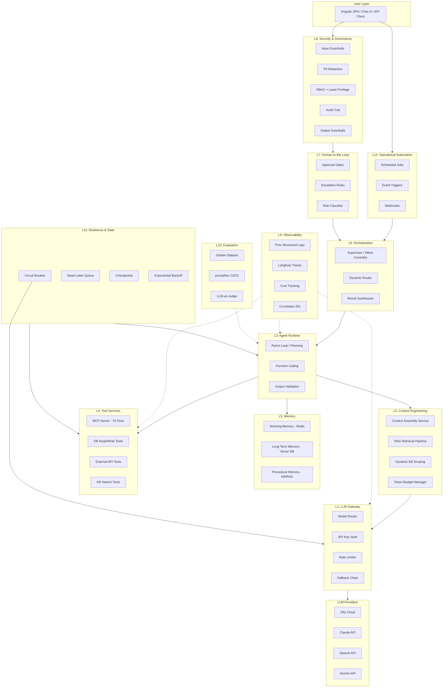

# Universal Agentic Architecture — Reference Framework

**Purpose:** A domain-agnostic, AGI-scalable reference architecture for building production-grade agentic systems. Synthesized from architectures at Palantir, Salesforce, Stripe, Google, Microsoft, Anthropic, OpenAI, and leading open-source frameworks (LangGraph, CrewAI, DSPy, Temporal).

**Scope:** This is a universal guiding framework — applicable to the COO NPA Workbench, future domain agents, and any enterprise multi-agent system.

**Date:** 2026-02-28
**Version:** 1.0

---

## Table of Contents

1. [The 12 Layers of a True Agentic Architecture](#1-the-12-layers)
2. [Layer 1: LLM Gateway — Secure Model Access](#layer-1-llm-gateway)
3. [Layer 2: Context Engineering — What the LLM Sees](#layer-2-context-engineering)
4. [Layer 3: Agent Runtime — The Reasoning Core](#layer-3-agent-runtime)
5. [Layer 4: Tool Services — What the Agent Can Do](#layer-4-tool-services)
6. [Layer 5: Memory — What the Agent Remembers](#layer-5-memory)
7. [Layer 6: Orchestration — Multi-Agent Coordination](#layer-6-orchestration)
8. [Layer 7: Human-in-the-Loop — Oversight & Escalation](#layer-7-human-in-the-loop)
9. [Layer 8: Security & Governance — Trust Boundary](#layer-8-security-governance)
10. [Layer 9: Observability — End-to-End Visibility](#layer-9-observability)
11. [Layer 10: Evaluation — Quality Assurance](#layer-10-evaluation)
12. [Layer 11: Resilience & State — Durability](#layer-11-resilience-state)
13. [Layer 12: Operational Automation — Scheduling & Events](#layer-12-operational-automation)
14. [Protocol Layer: Inter-Agent & Inter-System Communication](#protocol-layer)
15. [Technology Selection Matrix](#technology-matrix)
16. [Industry Reference Comparison](#industry-comparison)
17. [Architecture Diagram](#architecture-diagram)

---

## 1. The 12 Layers of a True Agentic Architecture {#1-the-12-layers}

Every production agentic system — regardless of domain, model provider, or scale — requires these 12 architectural layers. Missing any one creates a gap that becomes a production incident.

```
┌─────────────────────────────────────────────────────────────────────┐
│                    THE 12-LAYER AGENTIC STACK                       │
│                                                                     │
│  ┌─────────────────────────────────────────────────────────────┐   │
│  │ L12: OPERATIONAL AUTOMATION                                  │   │
│  │     Scheduled jobs, event-driven triggers, cron, webhooks    │   │
│  ├─────────────────────────────────────────────────────────────┤   │
│  │ L11: RESILIENCE & STATE                                      │   │
│  │     Checkpointing, durable execution, DLQ, circuit breakers  │   │
│  ├─────────────────────────────────────────────────────────────┤   │
│  │ L10: EVALUATION                                              │   │
│  │     Golden datasets, regression testing, LLM-as-judge, CI/CD │   │
│  ├─────────────────────────────────────────────────────────────┤   │
│  │ L9:  OBSERVABILITY                                           │   │
│  │     Structured logging, distributed tracing, cost tracking   │   │
│  ├─────────────────────────────────────────────────────────────┤   │
│  │ L8:  SECURITY & GOVERNANCE                                   │   │
│  │     PII redaction, guardrails, RBAC, audit trail, trust layer│   │
│  ├─────────────────────────────────────────────────────────────┤   │
│  │ L7:  HUMAN-IN-THE-LOOP                                       │   │
│  │     Approval gates, escalation, risk-based routing           │   │
│  ├─────────────────────────────────────────────────────────────┤   │
│  │ L6:  ORCHESTRATION                                           │   │
│  │     Multi-agent coordination, supervisor, handoff, pipeline  │   │
│  ├─────────────────────────────────────────────────────────────┤   │
│  │ L5:  MEMORY                                                  │   │
│  │     Working memory, long-term semantic, episodic, procedural │   │
│  ├─────────────────────────────────────────────────────────────┤   │
│  │ L4:  TOOL SERVICES                                           │   │
│  │     MCP tools, APIs, DB queries, external systems, actions   │   │
│  ├─────────────────────────────────────────────────────────────┤   │
│  │ L3:  AGENT RUNTIME                                           │   │
│  │     ReAct loop, planning, reasoning, function calling        │   │
│  ├─────────────────────────────────────────────────────────────┤   │
│  │ L2:  CONTEXT ENGINEERING                                     │   │
│  │     Dynamic assembly, retrieval, pruning, budget management  │   │
│  ├─────────────────────────────────────────────────────────────┤   │
│  │ L1:  LLM GATEWAY                                             │   │
│  │     Model routing, API keys, rate limits, cost controls      │   │
│  └─────────────────────────────────────────────────────────────┘   │
│                                                                     │
│  ═══════════════════════════════════════════════════════════════    │
│  PROTOCOL LAYER (cross-cutting): MCP + A2A + ACP + OpenTelemetry   │
│  ═══════════════════════════════════════════════════════════════    │
└─────────────────────────────────────────────────────────────────────┘
```

### Why 12 Layers?

| Source | What They Define | Our Mapping |
|--------|-----------------|-------------|
| **Palantir AIP** | 12 modules (Context, Ontology, Tools, Security, Agent Lifecycle, Automation, etc.) | Layers 1-12 map directly to Palantir's 12 numbered modules |
| **Salesforce Agentforce** | Atlas Engine + Topics/Actions + Trust Layer + Data 360 + Agent Fabric | L3 (Runtime) + L4 (Tools) + L8 (Security) + L2 (Context) + L6 (Orchestration) |
| **Stripe** | Gateway + Scoped Tokens + Fraud Detection + Audit | L1 (Gateway) + L8 (Security) + L7 (HITL) + L9 (Observability) |
| **Google ADK/Vertex** | Agent Engine + Memory Bank + Grounding + A2A + Threat Detection | L3 (Runtime) + L5 (Memory) + L2 (Context) + L6 (Orchestration) + L8 (Security) |
| **Microsoft Agent Framework** | Kernel + Plugins + Orchestration Patterns + A2A | L3 (Runtime) + L4 (Tools) + L6 (Orchestration) + Protocol Layer |
| **Anthropic** | Tool Use + Context Engineering Guide + Building Effective Agents | L4 (Tools) + L2 (Context) + L3 (Runtime) |
| **OpenAI** | Agents SDK + Assistants API + Function Calling + Guardrails | L3 (Runtime) + L4 (Tools) + L8 (Security) |

No single company implements all 12 layers equally well. The framework synthesizes the strongest pattern from each.

---

## Layer 1: LLM Gateway — Secure Model Access {#layer-1-llm-gateway}

**What it does:** Controls how your system connects to LLMs. Model routing, authentication, rate limiting, cost enforcement, and provider abstraction.

**Why it's a separate layer:** You should be able to swap models (GPT-4o → Claude → Gemini → open-source) without changing agent code. The gateway absorbs provider differences.

### Components

| Component | Purpose | Industry Reference |
|-----------|---------|-------------------|
| **Model Router** | Routes requests to the right model based on task complexity, cost, latency requirements | Palantir AIP Module 1 (Commercial + Open-Source model routing) |
| **API Key Vault** | Centralized secret management; keys never in code, never exposed to frontend | Stripe (env-scoped Restricted API Keys), Salesforce (Trust Layer ZDR) |
| **Rate Limiter** | Per-model, per-user, per-agent rate limiting to prevent cost explosions | Standard across all platforms |
| **Cost Controller** | Token budget per request, per session, per user, per day. Kill switch on budget breach | Langfuse cost tracking, FinOps dashboards |
| **Provider Abstraction** | Unified interface across OpenAI, Anthropic, Google, open-source models | LiteLLM (CrewAI), Semantic Kernel AI Service Registry |
| **Fallback Chain** | Primary model → fallback model → cached response → graceful error | Microsoft Agent Framework retry policies |

### Architectural Patterns

**Model Tiering (Palantir + Microsoft):**
Not every agent needs the frontier model. Route by complexity:

```
Tier 1 (Routing/Classification): Small, fast model (Haiku, GPT-4o-mini)
  → Agent: Intent classifier, topic router, format validator
  → Cost: $0.001/call

Tier 2 (Standard Reasoning): Mid-tier model (Sonnet, GPT-4o)
  → Agent: Most domain agents (risk, governance, monitoring)
  → Cost: $0.01-0.05/call

Tier 3 (Complex Reasoning): Frontier model (Opus, o3, Gemini Ultra)
  → Agent: Orchestrator, complex multi-step reasoning, edge cases
  → Cost: $0.10-1.00/call
```

**Zero Data Retention (Salesforce Trust Layer):**
Contractual agreements with LLM providers that customer data is never stored on provider infrastructure. The prompt and response are forgotten the moment they are processed.

### Anti-Patterns

- Hardcoding API keys in source code (your current `MBS@2026` and JWT fallback)
- Single model dependency with no fallback
- No cost visibility until the monthly bill arrives
- Exposing model provider details to the frontend

---

## Layer 2: Context Engineering — What the LLM Sees {#layer-2-context-engineering}

**What it does:** Assembles, selects, scopes, and manages the information that enters the LLM's context window. This is the single highest-leverage layer — the quality of context determines the quality of output more than the model itself.

**Industry consensus:** Palantir makes this Module #3 with three sub-layers (Contextual Data, Contextual Logic, Systems of Action). Anthropic's Context Engineering Guide calls it "the art of providing the right information in the right format." LangChain's blog post defines it as "write context + select context."

### Three Sub-Layers (Palantir Model)

```
CONTEXT ENGINEERING
│
├── CONTEXTUAL DATA — What information is available
│   ├── Real-time DB state (via MCP tools or pre-fetch)
│   ├── Knowledge base documents (via RAG retrieval)
│   ├── Prior agent results (inter-wave context)
│   ├── User profile and role data
│   ├── Historical examples (few-shot)
│   └── External data feeds (market data, sanctions lists)
│
├── CONTEXTUAL LOGIC — Rules for selecting and filtering
│   ├── Dynamic scoping (product category → relevant KB subset)
│   ├── Token budget management (allocate by category)
│   ├── Relevance scoring (prune low-value context)
│   ├── Conflict resolution (contradictory KB docs)
│   ├── Role-based filtering (approver vs maker sees different data)
│   └── Freshness validation (reject stale data)
│
└── SYSTEMS OF ACTION — How context flows
    ├── Pre-fetch pipeline (parallel DB queries before LLM call)
    ├── RAG retrieval pipeline (embed → search → rerank → inject)
    ├── Inter-agent context passing (typed contracts)
    ├── Context caching (TTL-based, invalidation-aware)
    └── Context compression (summarization, pruning, tool output trimming)
```

### Context Window Budget Management

Treat the context window like a memory budget — finite, allocated by category, monitored per request:

```
Total Context Budget = Model Limit (e.g., 128K tokens)
  ├── System Prompt:        2-5K   (fixed overhead — role, rules, format)
  ├── Tool Schemas:         1-10K  (varies by tool count; filter with RAG at scale)
  ├── Retrieved Knowledge:  10-30K (RAG results; chunk size tuning required)
  ├── Few-Shot Examples:    2-5K   (2-3 examples matching current task type)
  ├── Conversation History: 10-50K (managed via sliding window + summarization)
  ├── Prior Agent Results:  5-15K  (inter-wave context, compacted)
  └── Current Task + Buffer: 5-20K (response generation headroom)
```

### Four Failure Modes (Production-Observed)

| Failure Mode | Description | Fix |
|-------------|-------------|-----|
| **Context Poisoning** | Hallucinated fact enters context and compounds across steps | Output validation before context injection |
| **Context Distraction** | Too much history causes over-anchoring on past behavior | Selective pruning by relevance scoring |
| **Context Confusion** | Irrelevant tools/docs mislead agent reasoning | Dynamic tool/KB scoping per task |
| **Context Clash** | Contradictory information causes decision paralysis | Conflict resolution strategy (recency, authority ranking) |

### Delivery Strategy: Pre-Load vs Self-Serve

Not all context should be pre-loaded. The right strategy depends on agent type:

| Agent Type | Context Strategy | Rationale |
|-----------|-----------------|-----------|
| **Single-pass LLM Nodes** (no tool access) | Pre-enrich all required context | Cannot self-serve; must receive everything upfront |
| **ReAct Agents** (with tools) | Pre-load baseline + self-serve via tools | Baseline saves tool iterations; tools handle conditional needs |
| **Chatflow/Conversational** | Pre-load user context + let agent retrieve on demand | Conversational agents discover needs through dialogue |

### Industry References

| Company | Context Engineering Approach |
|---------|----------------------------|
| **Palantir** | MMDP platform — real-time, pro-code/no-code context assembly with Ontology grounding |
| **Salesforce** | Data 360 — unified CRM data layer providing real-time grounding to Atlas reasoning engine |
| **Google** | Three grounding mechanisms: Google Search (public), Vertex AI Search (enterprise), Custom Search API |
| **Anthropic** | Context Engineering Guide — explicit guidance on structuring information for Claude |
| **DSPy** | Compiled context — optimizer selects optimal few-shot examples and instructions from training data |

---

## Layer 3: Agent Runtime — The Reasoning Core {#layer-3-agent-runtime}

**What it does:** The LLM reasoning engine that receives context, decides what to do, calls tools, observes results, and iterates until task completion. This is the "brain" of the agent.

### Runtime Patterns (Complexity Spectrum)

| Level | Pattern | Description | When to Use |
|-------|---------|-------------|------------|
| 0 | **Direct LLM Call** | Single prompt → single response, no tools | Simple Q&A, classification, formatting |
| 1 | **Single Agent + Tools** | ReAct loop: Reason → Act (tool call) → Observe → repeat | Most production use cases |
| 2 | **Workflow/Pipeline** | Deterministic chain of LLM nodes, each with typed I/O | Multi-step analysis with known steps |
| 3 | **Orchestrated Multi-Agent** | Supervisor agent routes to specialized sub-agents | Complex tasks requiring diverse expertise |

### Core Runtime Components

```
AGENT RUNTIME
│
├── Reasoning Engine
│   ├── ReAct Loop (Salesforce Atlas, most frameworks)
│   │   Think → Act → Observe → Think → ... → Final Answer
│   ├── Planning (Microsoft Magentic-One Task Ledger)
│   │   Analyze → Plan → Execute Steps → Reflect → Replan if needed
│   └── Function Calling (native LLM capability)
│       Receive tool schemas → Emit structured tool calls → Process results
│
├── Execution Controls
│   ├── Max Iterations Cap (MANDATORY — prevents infinite loops)
│   ├── Token Budget per Turn (prevents runaway costs)
│   ├── Timeout per Agent Call (prevents indefinite blocking)
│   └── Confidence Threshold (below threshold → escalate to human)
│
├── Output Processing
│   ├── Schema Validation (Zod/Pydantic — validate before persistence)
│   ├── Structured Output Enforcement (JSON mode, typed responses)
│   └── Fallback Extraction (parse unstructured text when JSON fails)
│
└── Agent Configuration
    ├── System Prompt (role, rules, format, examples)
    ├── Tool Manifest (available tools with schemas)
    ├── Guardrail Rules (what the agent must/must not do)
    └── Model Assignment (which LLM powers this agent)
```

### Determinism Spectrum (Salesforce's 5 Levels)

Production systems need explicit control over how much autonomy the LLM has:

```
Level 1: Full LLM Autonomy    → Maximum flexibility, minimum predictability
Level 2: Topic-Scoped LLM     → LLM operates only within defined topic boundaries
Level 3: Instruction-Guided   → Explicit instructions constrain behavior within topics
Level 4: Hybrid Reasoning     → Deterministic paths for critical steps + LLM for conversation
Level 5: Fully Deterministic  → Code executes fixed logic; LLM used only for NLU parsing
```

**Key insight from Salesforce:** Most enterprise agents should operate at Level 3-4. Pure Level 1 is appropriate only for creative/exploratory tasks. Level 5 isn't really "agentic" — it's traditional automation with NLU.

### Agent Type Taxonomy (Google ADK)

| Type | Behavior | Implementation |
|------|----------|---------------|
| **LlmAgent** | LLM-driven dynamic reasoning | ReAct loop, function calling |
| **SequentialAgent** | Fixed pipeline of sub-agents | Deterministic chain |
| **ParallelAgent** | Concurrent sub-agent execution | Fan-out/fan-in |
| **LoopAgent** | Repeat until exit condition | Draft-and-review, quality gates |
| **CustomAgent** | Arbitrary control flow | Fully programmable |

---

## Layer 4: Tool Services — What the Agent Can Do {#layer-4-tool-services}

**What it does:** The agent's hands and feet. Tools connect agents to external systems — databases, APIs, file systems, web browsers, other services. Without tools, an agent can only produce text.

### Tool Architecture

```
TOOL SERVICES
│
├── Data Tools (READ)
│   ├── Database queries (get_npa_by_id, list_customers)
│   ├── Knowledge base search (semantic retrieval, keyword search)
│   ├── API data fetch (market data, external ratings)
│   └── File/document readers
│
├── Action Tools (WRITE)
│   ├── Database mutations (update_status, create_record)
│   ├── External API calls (send_notification, create_ticket)
│   ├── System operations (file creation, code execution)
│   └── Inter-agent delegation (call sub-agent via A2A)
│
├── Compute Tools (TRANSFORM)
│   ├── Code execution (sandboxed Python, calculations)
│   ├── Data transformation (format conversion, aggregation)
│   └── Validation (schema check, business rule verification)
│
└── Tool Governance
    ├── Per-agent allowlisting (agent X can only call tools A, B, C)
    ├── Pre-execution policy checks (authorization before destructive actions)
    ├── Rate limiting per tool (prevent runaway tool calls)
    └── Tool description RAG (when 50+ tools, filter to relevant subset)
```

### Protocol: MCP (Model Context Protocol)

MCP is the emerging standard for agent-to-tool communication, supported by Anthropic, OpenAI, Google, Microsoft, Salesforce, and Stripe:

```
MCP Architecture:
  MCP Host (IDE, Agent, App)
    └── MCP Client (protocol handler)
         └── MCP Server (tool provider)
              ├── Tools (callable functions with typed schemas)
              ├── Resources (data the server exposes)
              └── Prompts (templated interactions)
```

**Stripe's MCP Pattern (Best Practice for Financial Tools):**
- MCP server is permission-aware — only exposes tools matching the scoped API key
- Operators control what the LLM can do at the key configuration level
- Sandbox-first development — evaluate before production deployment

### Tool Design Principles

| Principle | Description | Source |
|-----------|-------------|--------|
| **Minimal surface** | Expose only the tools the agent needs; too many tools reduces selection accuracy | Stripe Agent Toolkit |
| **Idempotent by default** | Every tool should be safe to retry on failure | Temporal Activities |
| **Typed I/O** | Every tool has a JSON Schema for inputs and outputs | All frameworks |
| **Composite tools** | For agents with iteration limits, combine related queries into single tools | Operational experience |
| **Scoped permissions** | Tools enforce their own authorization, not just the agent's | Palantir, Stripe |

---

## Layer 5: Memory — What the Agent Remembers {#layer-5-memory}

**What it does:** Manages information persistence across turns, sessions, and time. Without memory, every interaction starts from zero.

### Four-Tier Memory Model

```
MEMORY ARCHITECTURE
│
├── Tier 0: Context Window (active workspace)
│   ├── Capacity: 128K-1M tokens (model-dependent, scarce)
│   ├── Latency: Zero (already in model)
│   ├── Scope: Current reasoning step
│   └── Contents: System prompt, tool results, recent messages
│
├── Tier 1: Working Memory (session-scoped)
│   ├── Capacity: Bounded (sliding window)
│   ├── Latency: Sub-millisecond
│   ├── Scope: Single session/conversation
│   ├── Contents: Full message history, intermediate results
│   └── Implementation: Redis, in-process list, LangGraph checkpointer
│
├── Tier 2: Long-Term Semantic Memory (cross-session)
│   ├── Capacity: Effectively unbounded
│   ├── Latency: 5-50ms (vector search)
│   ├── Scope: User-level or org-level
│   ├── Contents: Past interaction summaries, learned preferences, entity facts
│   └── Implementation: pgvector, Pinecone, Weaviate, Google Memory Bank
│
└── Tier 3: Procedural/Declarative Knowledge (static retrieval)
    ├── Capacity: Unbounded
    ├── Latency: 10-100ms
    ├── Scope: Organization-wide
    ├── Contents: SOPs, policies, domain knowledge, workflow definitions
    └── Implementation: RAG over document corpus, knowledge graphs
```

### Three Types of Long-Term Memory

| Type | What It Stores | How It's Used | Example |
|------|---------------|---------------|---------|
| **Episodic** | Records of past interactions — what happened, when, what the outcome was | Personalization, learning from experience | "Last time NPA-2026-001 was assessed, the Risk agent flagged cross-border FX as HIGH" |
| **Semantic** | Factual knowledge about the domain and users | Grounding, accuracy | "Finance VP approval required for notional > $50M" |
| **Procedural** | How-to knowledge — patterns for executing task types | Task efficiency, consistency | "For NPA Lite B3, skip governance signoff and route directly to HOD" |

### Write-Through Cache Pattern

```
User message arrives
  → Append to Tier 1 (working memory) immediately
  → Query Tier 2 (semantic memory) for relevant prior context
  → Query Tier 3 (procedural knowledge) for relevant SOPs
  → Assemble context window: [system prompt] + [retrieved memories] + [working memory tail]
  → Run LLM
  → After response: extract significant new facts → score for importance → write to Tier 2
```

### Industry References

| Company | Memory Architecture |
|---------|-------------------|
| **Google** | Memory Bank (GA) — generates long-term memories from sessions, scoped to user identity |
| **CrewAI** | Unified Memory API — short-term (ChromaDB), long-term (SQLite), entity (vector RAG) |
| **LangGraph** | Checkpointer (session state) + Store (cross-session key-value) |
| **Microsoft** | Semantic Kernel ISemanticTextMemory (vector store abstraction) |

---

## Layer 6: Orchestration — Multi-Agent Coordination {#layer-6-orchestration}

**What it does:** Coordinates multiple agents working together on complex tasks. Routes work, manages dependencies, handles inter-agent communication, and synthesizes results.

### Orchestration Pattern Taxonomy

```
Complexity →

L0: Direct         L1: Single Agent    L2: Sequential     L3: Concurrent
[LLM Call]         [Agent + Tools]     [A → B → C]        [A ┬→ B]
                                                           [  └→ C]

L4: Supervisor     L5: Handoff         L6: Magentic
[Supervisor]       [A →? B →? C]       [Manager + Ledger]
[↙  ↓  ↘]         [Dynamic routing]   [Adaptive planning]
[A] [B] [C]
```

| Pattern | Routing | Best For | Risk | Industry Reference |
|---------|---------|----------|------|-------------------|
| **Sequential (Pipeline)** | Deterministic, predefined | Step-by-step refinement, ETL | Early failure propagates | Google SequentialAgent |
| **Concurrent (Fan-out/in)** | Deterministic parallel | Independent parallel analysis | Conflict resolution needed | Google ParallelAgent |
| **Supervisor** | Central orchestrator decides | Regulated industries, audit trail | Single point of failure | LangGraph Supervisor, Databricks |
| **Handoff (Swarm)** | Agents decide who's next | Dynamic routing, triage | Infinite handoff loops | OpenAI Swarm → LangGraph, AutoGen |
| **Group Chat** | LLM-selected turns | Consensus, maker-checker | Conversation loops > 3 agents | AutoGen GroupChat |
| **Magentic (Task Ledger)** | Manager builds/adapts plan | Open-ended complex problems | Slow convergence | Microsoft Magentic-One |
| **Guided Determinism** | Graph + LLM hybrid | Compliance-critical flows | Over-constraining flexibility | Salesforce Agent Graph |

### Inter-Agent Communication Patterns

| Pattern | How Context Passes | Token Cost | Best For |
|---------|-------------------|------------|----------|
| **Full pass-through** | Next agent gets everything prior agent saw | High | Maximum accuracy, small teams |
| **Compacted summary** | Orchestrator summarizes before handoff | Medium | Token-constrained, multi-hop |
| **Typed contract** | Only declared output schema passes forward | Low | Independent agents, clear interfaces |
| **Shared state** | Agents read/write a common state object | Variable | LangGraph State, Google ADK context.state |

### Multi-Agent Fabric (Salesforce MuleSoft Pattern)

For enterprise-scale multi-agent systems:

```
AGENT FABRIC
├── Agent Registry    — Central catalog of all agents, capabilities, status
├── Agent Broker      — Intelligent routing: match task intent → right agent
├── Agent Runtime     — Cross-agent workflow execution
└── Agent Visualizer  — Dynamic map of agent ecosystem, interactions, health
```

---

## Layer 7: Human-in-the-Loop — Oversight & Escalation {#layer-7-human-in-the-loop}

**What it does:** Gates agent actions by risk classification. Humans approve high-risk operations, review edge cases, and handle escalations. NOT a blanket "ask the human" pattern — gate by risk, not by default.

### Risk Classification Matrix

```
Risk Tier    | Action Type                           | Approval Required?
─────────────|───────────────────────────────────────|──────────────────
Critical     | Irreversible destructive operations    | Synchronous human approval
             | (payments, bulk delete, publish)       |
High         | External API calls with side effects   | Async review queue (4h SLA)
             | (notifications, ticket creation)       |
Medium       | Configuration changes, data exports    | Auto-approve with audit log
Low          | Read-only, even with sensitive data     | Auto-approve with log
Routine      | All other agent actions                | Fully autonomous
```

### Technical Interrupt Patterns

| Pattern | Implementation | Durability | Source |
|---------|---------------|------------|--------|
| **Checkpoint-and-Resume** | Agent state serialized, execution pauses, resumes on approval | Full (days/weeks) | LangGraph `interrupt()` + `Command(resume=...)` |
| **Signal-and-Wait** | External signal injected into running workflow | Full (months) | Temporal `workflow.signal()` + `wait_condition()` |
| **MCP Elicitation** | Tool call blocks until human responds via UI form | Session-scoped | MCP `elicitInput()` |
| **Approval Queue** | Action placed in queue, reviewed in batch | Full | Salesforce Omni-Channel, Cloudflare Agents |

### Escalation Patterns (Salesforce)

| Pattern | Description | Use Case |
|---------|-------------|----------|
| **Greeter** | Agent collects intent → routes to human with summary | Simple, low-friction |
| **Operator** | Agent attempts resolution → escalates on failure/low confidence | Most enterprise cases |
| **Sentiment-based** | Negative sentiment detected → mandatory human takeover | Customer service |
| **Categorical** | Legal, security, or sensitive topics → always human | Compliance-critical |

### Anti-Patterns

- **Approval fatigue**: Too many approval requests → rubber-stamping. Gate by risk tier, not everything.
- **Blocking synchronous approvals**: Never block a user-facing real-time path for human approval. Use async.
- **No context in handoff**: The "amnesia problem" — customer repeats themselves. Always pass full conversation history + summary + actions-already-taken in handoff payload.
- **Agent acts before approval**: Agent must NOT optimistically proceed. Approval confirmation BEFORE execution.

---

## Layer 8: Security & Governance — Trust Boundary {#layer-8-security-governance}

**What it does:** Wraps every prompt-to-response journey in security controls. PII protection, prompt injection defense, output filtering, access control, and immutable audit trail.

### Five-Layer Defense Stack

```
SECURITY & GOVERNANCE
│
├── Layer 1: Application Guardrails (Input/Output)
│   ├── INPUT:  Prompt injection detection, PII detection, topic filtering
│   ├── OUTPUT: Response filtering, PII leakage check, format validation
│   └── Tools: Presidio, LlamaFirewall, NeMo Guardrails, Guardrails AI
│
├── Layer 2: API Security
│   ├── Authentication (JWT, OAuth, mTLS between agents)
│   ├── Authorization (RBAC — which agents can call which tools)
│   ├── Rate limiting (per agent, per user, per endpoint)
│   └── Token budget enforcement (per-request and per-session caps)
│
├── Layer 3: Identity & Least-Privilege
│   ├── Service accounts per agent with minimal required permissions
│   ├── No shared credentials across agents
│   ├── Role isolation (read agent ≠ write agent ≠ delete agent)
│   └── Google: agent-native IAM identities as first-class principals
│
├── Layer 4: Data Access Control
│   ├── Data classification (public, internal, confidential, restricted)
│   ├── Per-user security trimming on KB queries
│   ├── Retrieval-time ACL filtering (not ingest-time)
│   └── Sensitive data redaction before LLM injection
│
└── Layer 5: Runtime & Infrastructure
    ├── Network isolation (agents in private subnets, egress-controlled)
    ├── Anomalous behavior detection (unexpected tool sequences)
    ├── Workload segmentation (sensitive data agents isolated)
    └── Google Threat Detection (adversarial input detection)
```

### Trust Layer (Salesforce Pattern — Gold Standard)

The entire prompt-to-response journey is wrapped:

```
User Input
  → Data Masking (PII → placeholders, reversible)
  → Prompt Injection Defense (heuristic + classifier)
  → LLM Call (Zero Data Retention contract)
  → Toxicity Detection (violence, sexual, profanity, hate, harm)
  → Output Validation (schema check, policy compliance)
  → Data Unmasking (placeholders → real values for authorized users)
  → Audit Trail (every step timestamped and logged)
  → Response to User
```

### Stripe's Financial Safety Pattern

For agents handling money or high-value operations:

```
SCOPED AUTHORIZATION TOKENS
├── User confirms intent → platform issues Shared Payment Token (SPT)
├── SPT scoped to: specific seller + time window + max amount + payment method
├── Agent NEVER receives raw credentials
├── Tokens revocable at any time
├── Full audit trail and reconciliation metadata
└── Fraud detection (Stripe Radar) applied to every token-based transaction
```

This pattern generalizes to any high-value agent action: scope the authorization, make it revocable, never give the agent raw credentials.

---

## Layer 9: Observability — End-to-End Visibility {#layer-9-observability}

**What it does:** Makes the entire agent system visible, debuggable, and measurable. From user click to LLM token to tool call to database write — every step is traced.

### Trace Hierarchy

```
Session (multi-turn conversation lifetime)
  └─ Trace (single end-to-end request)
       ├─ Span: Agent Decision Node
       │    ├─ Generation (LLM call: prompt, completion, token counts, cost)
       │    ├─ Retrieval (RAG query: index hit, latency, chunk count)
       │    └─ Tool Call (MCP tool: method, args, response, latency)
       └─ Span: Sub-agent invocation (nested, same structure)
```

### Five Observability Pillars

| Pillar | What It Tracks | How It's Used |
|--------|---------------|---------------|
| **Distributed Tracing** | Correlation IDs across all services (Frontend → API → LLM → Tools → DB) | End-to-end debugging |
| **Continuous Evaluation** | LLM-as-judge scoring on sampled traces (async, non-blocking) | Quality monitoring |
| **Prompt Optimization** | Which prompt version × which model → which quality scores | A/B testing prompts |
| **RAG Monitoring** | Retrieval quality → generation quality correlation | Context engineering feedback |
| **Cost Accounting** | Tokens × model pricing → cost per trace/session/user/feature | FinOps |

### Alert Patterns

| Signal | Threshold | Routing |
|--------|-----------|---------|
| Latency p95 spike | Dynamic baseline + 2 sigma | PagerDuty |
| Evaluation score drop | Absolute (e.g., score < 0.7) | Slack |
| Hallucination rate increase | Rolling 1h vs 24h baseline | Engineering on-call |
| Token cost per request spike | 3x rolling average | FinOps alert |
| Tool call failure rate | > 5% over 10 min | Immediate page |

### Industry Stack

| Tool | Purpose | Used By |
|------|---------|---------|
| **Langfuse** | LLM traces, evals, prompt management, cost tracking | Native Dify integration |
| **OpenTelemetry** | Distributed tracing standard | Cross-industry |
| **Pino/Winston** | Structured JSON logging (Node.js) | Express.js services |
| **Prometheus/Grafana** | Metrics collection and dashboarding | Infrastructure monitoring |

---

## Layer 10: Evaluation — Quality Assurance {#layer-10-evaluation}

**What it does:** Systematically measures whether agents are producing correct, safe, and useful outputs. Not manual testing — automated, continuous, and integrated into CI/CD.

### Three-Layer Evaluation Taxonomy (Anthropic + Amazon)

```
EVALUATION LAYERS
│
├── Layer 1: Black-Box (End-to-End / Behavioral)
│   ├── Did the task complete successfully from the user's perspective?
│   ├── Check actual environment state (DB row exists, email sent, file modified)
│   ├── NOT the agent's claim that it succeeded — verify independently
│   └── Metrics: TaskCompletionMetric, pass/fail, user satisfaction
│
├── Layer 2: Glass-Box (Trajectory / Path)
│   ├── Did the agent take a reasonable sequence of actions?
│   ├── Catches agents that "get lucky" via broken paths
│   ├── Metrics: PlanQualityMetric, StepEfficiencyMetric, tool call ordering
│   └── Were unnecessary steps taken? Were critical steps skipped?
│
└── Layer 3: White-Box (Component / Per-Step)
    ├── At each decision point, was reasoning and action correct?
    ├── Per-span evaluation scores via @observe decorators
    ├── Metrics: ToolCorrectnessMetric, ArgumentCorrectnessMetric
    └── Individual LLM call quality assessment
```

### Grader Hierarchy (Anthropic Recommended)

```
Priority order (use the simplest grader that works):

1. Deterministic Graders (fastest, most reliable)
   → String matching, regex, schema validation, environment state checks
   → Use wherever possible

2. LLM-as-Judge Graders (for nuanced quality assessment)
   → Calibrated rubric-based scoring
   → Must be validated against human judgments before production use

3. Human Review (ground truth calibration)
   → Reserved for grader calibration, high-stakes edge cases
   → "You won't know if your graders work unless you read the transcripts"
```

### Evaluation Pipeline

```
Development Pipeline:
  Golden Dataset → Agent Harness → Trace Collection → Metric Runner → Score Dashboard

Production Pipeline:
  Live Traffic → Sampler (5%) → Async Trace Export → Metric Collection → Alert
                                                           ↓
                                            Human Review Queue (flagged traces)
                                                           ↓
                                            Golden Dataset Expansion (curated failures)
```

### Prompt Regression Testing (promptfoo)

```yaml
# promptfoo.yaml — runs on every prompt change, blocks deployment on regression
providers:
  - id: dify-risk-agent
    config:
      url: https://api.dify.ai/v1/workflows/run

tests:
  - vars: { project_id: "NPA-TEST-HIGH-RISK" }
    assert:
      - type: json-schema
        value: { "required": ["overallScore", "overallRating", "domainAssessments"] }
      - type: llm-rubric
        value: "Output must contain risk scores for at least 4 domains"
      - type: javascript
        value: "output.overallScore >= 0 && output.overallScore <= 100"
```

### DSPy's Compiled Evaluation (Stanford — Unique Approach)

Instead of hand-tuning prompts and hoping they work:

```
Developer provides: program + training data + metric function
DSPy optimizer: tries thousands of instruction/example combinations
Output: compiled program with measurably optimal prompts
Guarantee: every prompt change is validated against the metric
```

This is the future of evaluation — prompts as learnable parameters, not artisanal strings.

---

## Layer 11: Resilience & State — Durability {#layer-11-resilience-state}

**What it does:** Ensures agents survive failures, can resume from checkpoints, and handle external system outages gracefully.

### Circuit Breaker (Netflix Hystrix Pattern)

```
CLOSED (normal) → error rate > 50% → OPEN (fail-fast for 30s)
                                           ↓ cooldown expires
                                      HALF_OPEN (allow 1 probe)
                                           ↓ success → CLOSED
                                           ↓ failure → OPEN
```

When the circuit is OPEN, return cached/fallback responses immediately instead of waiting for timeouts.

### Multi-Level Checkpointing

```
Level 0: In-memory (within single process)
  → Scope: Current session | Latency: Sub-ms | Durability: None
  → Use: Time-travel debugging within a session

Level 1: Fast local (SSD/Redis)
  → Scope: Current session | Frequency: Every tool call | Durability: Survives restart
  → Use: Fast recovery from transient failures

Level 2: Durable remote (PostgreSQL, S3)
  → Scope: Cross-session | Frequency: Significant transitions | Durability: Full
  → Use: Long-running workflows, HITL pause/resume, audit
```

### Durable Execution (Temporal Pattern)

The gold standard for long-running agent workflows:

```python
# Temporal records EVERY event in append-only history
# If worker crashes → new worker replays history → resumes exactly where it stopped
# No checkpoint code needed — it's automatic and transparent

@workflow.defn
class AgentWorkflow:
    @workflow.run
    async def run(self, task):
        # Each activity call is recorded — never re-executed on replay
        context = await workflow.execute_activity(fetch_context, task.project_id)
        result = await workflow.execute_activity(call_llm, context)
        await workflow.execute_activity(persist_result, result)
```

### Dead Letter Queue (DLQ)

```
Agent call fails → retry with exponential backoff (250ms, 500ms, 1s + jitter)
  → Max 3 retries → move to DLQ with full context:
    { input, agentId, error, timestamp, retry_count, correlation_id }
  → DLQ dashboard shows depth as health indicator
  → Manual review + replay capability
```

### Saga Pattern for Multi-Step Workflows

When an agent partially completes a multi-system workflow:

```
Step 1: Create record in System A  ✅ (compensating: delete record)
Step 2: Update status in System B  ✅ (compensating: revert status)
Step 3: Send notification          ❌ FAILED
  → Execute compensating operations in reverse: revert B, delete A
  → System returns to consistent state
```

---

## Layer 12: Operational Automation — Scheduling & Events {#layer-12-operational-automation}

**What it does:** Agents don't just respond to user requests — they act autonomously on schedules, events, and triggers.

### Three Automation Patterns

```
OPERATIONAL AUTOMATION
│
├── Scheduled Automation (Cron / BullMQ repeatable)
│   ├── Daily 02:00 → Re-run monitoring for all active projects
│   ├── Weekly Monday → Re-run risk assessment for pending items
│   ├── Monthly 1st → Generate compliance report
│   └── Every 15 min → SLA breach detection
│
├── Event-Driven Automation (Pub/Sub / Webhooks)
│   ├── Status change → trigger governance re-assessment
│   ├── Risk score > threshold → trigger escalation notification
│   ├── Document uploaded → trigger doc lifecycle validation
│   ├── SLA breached → trigger escalation + stakeholder notification
│   └── Agent result persisted → invalidate cache + notify subscribers
│
└── API-Driven Automation (External triggers)
    ├── Webhook endpoints for external system integration
    ├── Batch processing APIs for bulk agent runs
    └── Health check endpoints for infrastructure monitoring
```

### Job Queue Architecture (BullMQ Pattern)

```
Client → POST /api/agents/run → { jobId: "..." } (immediate response)
                                       ↓
                              BullMQ Queue (Redis)
                                       ↓
                              Worker picks up job
                                       ↓
                              Calls Dify API
                                       ↓
                              Persists result to DB
                                       ↓
                              Notifies client via SSE/webhook
```

Benefits: No HTTP timeout issues, automatic retries, DLQ, job prioritization, concurrency control.

---

## Protocol Layer: Inter-Agent & Inter-System Communication {#protocol-layer}

Cross-cutting protocols that enable interoperability:

| Protocol | Purpose | Layer | Supported By |
|----------|---------|-------|-------------|
| **MCP** (Model Context Protocol) | Agent ↔ Tool communication | L4 (Tools) | Anthropic, OpenAI, Google, Microsoft, Salesforce, Stripe |
| **A2A** (Agent2Agent) | Agent ↔ Agent communication | L6 (Orchestration) | Google, Microsoft, Salesforce (converging with MCP) |
| **ACP** (Agentic Commerce Protocol) | Agent ↔ Merchant checkout | L4 (Tools) + L8 (Security) | Stripe, OpenAI |
| **x402** | Machine-to-machine payments (HTTP 402) | L4 (Tools) | Stripe, Coinbase (Base) |
| **OpenTelemetry** | Distributed tracing standard | L9 (Observability) | Cross-industry standard |
| **AG-UI** | Agent ↔ Frontend UI interaction | L7 (HITL) | Microsoft Agent Framework |

### MCP vs A2A — Complementary, Not Competing

```
MCP = Vertical integration (agent reaches DOWN to tools, data, APIs)
A2A = Horizontal integration (agent reaches ACROSS to other agents)

An A2A client can delegate to an A2A server, which uses MCP internally to access tools.
They are complementary layers, not alternatives.
```

---

## Technology Selection Matrix {#technology-matrix}

### Recommended Stack by Layer

| Layer | Component | Recommended Tool | Alternatives | Why |
|-------|-----------|-----------------|-------------|-----|
| **L1: LLM Gateway** | Provider abstraction | LiteLLM | OpenRouter, custom | Model-agnostic, 100+ providers |
| **L1: LLM Gateway** | Cost control | Langfuse | Helicone | Integrated with tracing |
| **L2: Context** | RAG retrieval | Dify Knowledge Base + pgvector | Pinecone, Weaviate | Already in stack (Dify) |
| **L2: Context** | Few-shot optimization | DSPy | Manual curation | Compiled prompts, metric-driven |
| **L3: Runtime** | Agent framework | Dify (existing) + LangGraph (complex) | CrewAI, AutoGen | Dify for standard agents; LangGraph for stateful workflows |
| **L4: Tools** | Tool protocol | MCP (FastAPI) | OpenAPI, native | Already built (78 tools), industry standard |
| **L5: Memory** | Working memory | Redis | PostgreSQL | Fast, shared with job queue |
| **L5: Memory** | Long-term memory | pgvector (MariaDB compatible) | Pinecone, ChromaDB | Reuse existing DB infrastructure |
| **L6: Orchestration** | Multi-agent coordination | Dify Workflows + Express wave logic | LangGraph, CrewAI | Already working; upgrade path to LangGraph |
| **L7: HITL** | Approval gates | BullMQ + Slack/Email notifications | Temporal signals | Lightweight, no new infra |
| **L8: Security** | PII redaction | Presidio (Microsoft) | spaCy NER, custom regex | Enterprise-grade, 20+ PII types |
| **L8: Security** | Guardrails | NeMo Guardrails or LlamaFirewall | Guardrails AI | Open-source, production-tested |
| **L9: Observability** | LLM tracing | Langfuse | Phoenix (Arize), LangSmith | Native Dify integration, self-hostable |
| **L9: Observability** | Structured logging | Pino | Winston, Bunyan | 5x faster than Winston, JSON native |
| **L9: Observability** | Correlation IDs | uuid + custom middleware | OpenTelemetry | Lightweight, no new dependency |
| **L10: Evaluation** | Regression testing | promptfoo | Braintrust, custom | YAML-based, CI/CD native, free |
| **L10: Evaluation** | Agent metrics | DeepEval | Ragas, custom | 50+ metrics including 6 agentic-specific |
| **L11: Resilience** | Circuit breaker | opossum | cockatiel, custom | Netflix Hystrix-inspired, Node.js native |
| **L11: Resilience** | Job queue + DLQ | BullMQ + Redis | RabbitMQ, Celery | Node.js native, shared Redis |
| **L11: Resilience** | Durable execution | Temporal (future) | LangGraph checkpointer | Gold standard, but heavy; start with BullMQ |
| **L12: Automation** | Scheduled jobs | BullMQ repeatable jobs | node-cron, Agenda | Already using BullMQ for queue |
| **L12: Automation** | Event triggers | Express middleware + event bus | Redis Pub/Sub | Simple, no new infra |

---

## Industry Reference Comparison {#industry-comparison}

### How Each Company Implements the 12 Layers

| Layer | Palantir AIP | Salesforce Agentforce | Google Vertex/ADK | Microsoft Agent Framework | Stripe | Anthropic |
|-------|-------------|----------------------|-------------------|--------------------------|--------|-----------|
| **L1: LLM Gateway** | Multi-model (Commercial + OSS) | Einstein LLM + BYOM | Gemini-optimized, model-agnostic | AI Service Registry | Model-agnostic (via function calling) | Claude API |
| **L2: Context** | MMDP Platform | Data 360 + Intelligent Context | Vertex AI Search + Google Search | Semantic Kernel Memory | N/A (payment domain) | Context Engineering Guide |
| **L3: Runtime** | Proprietary | Atlas ReAct + Agent Graph | ADK LlmAgent + SequentialAgent | AutoGen Core + AgentChat | N/A (infrastructure) | Tool Use + ReAct |
| **L4: Tools** | Ontology Actions | Flows + Apex + Connectors | MCP + built-in tools | SK Plugins + MCP + OpenAPI | MCP Server + Agent Toolkit | MCP + Tool Use API |
| **L5: Memory** | Internal | Data 360 session history | Memory Bank (GA) | SK ISemanticTextMemory | N/A | Conversation context |
| **L6: Orchestration** | Internal | MuleSoft Agent Fabric | ADK multi-agent hierarchy | 6 patterns (Sequential → Magentic) | N/A | Building Effective Agents guide |
| **L7: HITL** | Approvals + Checkpoints | Greeter/Operator + Omni-Channel | Left to implementation | Interrupt/resume patterns | SPT human confirmation | Tool approval patterns |
| **L8: Security** | Enterprise DLP | Einstein Trust Layer | IAM agents + Threat Detection | Entra Agent Identity | Scoped tokens + Radar | Guardrails in prompts |
| **L9: Observability** | Proprietary metrics | Trust Layer audit trail | Agent Engine tracing | Azure Monitor | Webhook audit events | N/A (customer builds) |
| **L10: Evaluation** | Evaluation Suites | Testing Center | Gen AI Evaluation Service | Azure AI Evaluation | Sandbox + evals guidance | Demystifying Evals guide |
| **L11: Resilience** | Internal infra | Platform-managed | Platform-managed | Retry policies | N/A (API infra) | N/A (customer builds) |
| **L12: Automation** | Scheduled + Event-driven | Agent Flows + triggers | Cloud Scheduler + Pub/Sub | Azure Logic Apps | Webhooks + event subscriptions | N/A (customer builds) |

---

## Architecture Diagram {#architecture-diagram}

### The 12-Layer Stack (Visual)



### Request Flow: End-to-End Agent Call

```
User Request
  │
  ▼
[L8: Input Guardrails] ── prompt injection scan, PII detection
  │
  ▼
[L9: Observability] ── generate correlation ID, start trace
  │
  ▼
[L2: Context Engineering] ── fetch project data, select KB docs, inject few-shot examples
  │
  ▼
[L5: Memory] ── retrieve relevant prior context from working + long-term memory
  │
  ▼
[L1: LLM Gateway] ── route to appropriate model, check rate limits, track cost
  │
  ▼
[L3: Agent Runtime] ── ReAct loop: reason → call tools → observe → repeat
  │         │
  │         ▼
  │    [L4: Tool Services] ── MCP tools execute DB queries, API calls
  │         │
  │         ▼
  │    [L7: HITL Check] ── if tool action is high-risk → pause for approval
  │
  ▼
[L11: Resilience] ── checkpoint state, handle failures, retry with backoff
  │
  ▼
[L8: Output Guardrails] ── PII redaction, toxicity check, schema validation
  │
  ▼
[L9: Observability] ── end trace, record cost, async eval scoring
  │
  ▼
[L5: Memory] ── extract significant facts → score → write to long-term memory
  │
  ▼
[L10: Evaluation] ── async: sample trace → run quality metrics → update dashboards
  │
  ▼
Response to User
```

---

## Appendix A: Mapping to the COO NPA Workbench

This appendix will map each of the 12 layers to the current NPA Workbench implementation, identifying what exists, what's partially built, and what's missing. See `AGENTIC-ARCHITECTURE-AUDIT.md` for the detailed gap analysis.

| Layer | Current State | Score | Key Gap |
|-------|--------------|-------|---------|
| L1: LLM Gateway | Dify Cloud (single provider), env-var API keys | 2/5 | No model routing, no fallback chain, hardcoded secrets |
| L2: Context Engineering | 16 prompts (v2), 78 MCP tools, frontend `buildWorkflowInputs()` | 3/5 | No server-side assembly, no dynamic scoping, no token budget |
| L3: Agent Runtime | Dify Workflows + Chatflows, ReAct for chatflows | 4/5 | No iteration caps enforced at proxy level, no confidence thresholds |
| L4: Tool Services | 78 MCP tools (FastAPI), 17 categories | 4/5 | No tool governance (allowlisting per agent), no composite tools |
| L5: Memory | DB-first loading (30-min staleness), session state in Angular | 2/5 | No Redis working memory, no long-term semantic memory, no cross-session recall |
| L6: Orchestration | 4-wave RxJS pipeline, waveContext accumulation | 3/5 | No typed inter-agent contracts, no supervisor pattern, frontend-only |
| L7: HITL | Manual signoff workflows in DB | 2/5 | No risk-based gating, no approval-before-execution for agent actions |
| L8: Security | JWT + Helmet + rate limiting + RBAC + audit middleware | 3/5 | No PII redaction, CORS unrestricted, no input/output guardrails |
| L9: Observability | console.log, in-memory agent health metrics | 1/5 | No structured logging, no tracing, no cost tracking, no correlation IDs |
| L10: Evaluation | 1 smoke test, manual testing | 1/5 | No golden dataset, no regression testing, no automated eval |
| L11: Resilience | Rate limiting + timeouts + DB keepalive | 2/5 | No circuit breaker, no DLQ, no checkpointing, no backoff |
| L12: Automation | SLA monitor (15min), agent health (5min) | 2/5 | No job queue, no event-driven triggers, no scheduled re-assessments |

**Overall Maturity: 2.4/5 (Prototype → Production gap)**

---

## Appendix B: Sources

### Company Architecture References

| Company | Source | Key Contribution to This Framework |
|---------|--------|-----------------------------------|
| **Palantir** | AIP End-to-End Architecture (12 modules) | The 12-module structure that inspired our 12-layer model |
| **Salesforce** | Atlas Reasoning Engine, Trust Layer, Agent Graph, MuleSoft Agent Fabric | Guided determinism (5 levels), Trust Layer pattern, Agent Fabric |
| **Stripe** | Agentic Commerce Suite, MCP Server, Shared Payment Tokens | Scoped authorization tokens, financial safety patterns |
| **Google** | ADK, Agent Engine, Memory Bank, A2A Protocol, Vertex AI | Agent type taxonomy, Memory Bank, grounding architecture |
| **Microsoft** | Agent Framework, AutoGen, Semantic Kernel, Magentic-One, A2A | Orchestration patterns (6 types), actor model, A2A protocol |
| **Anthropic** | Building Effective Agents, Context Engineering Guide, Tool Use, Evals | Evaluation taxonomy, context engineering principles |
| **OpenAI** | Agents SDK, Assistants API, Swarm (deprecated → LangGraph) | Function calling as integration primitive |

### Framework References

| Framework | Source | Key Contribution |
|-----------|--------|-----------------|
| **LangGraph** | State graph architecture, checkpointing, interrupt() | Typed state management, durable HITL, multi-agent supervisors |
| **CrewAI** | Role-based agents, Flows, unified Memory | Role/task/crew abstraction, hierarchical process |
| **DSPy** | Compiled LM programs (Stanford NLP) | Prompts as learnable parameters, metric-driven optimization |
| **Temporal** | Durable execution engine | Automatic checkpoint/replay, signals for HITL, event history |

### Operational Pattern References

| Topic | Source |
|-------|--------|
| Observability | Langfuse, Maxim, Fractal Analytics, OneReach |
| Evaluation | Anthropic "Demystifying Evals", Amazon AWS, DeepEval, orq.ai |
| Memory | Redis, AWS AgentCore, Jit.io, Mem0, MachineLearningMastery |
| Security | Wiz, LlamaFirewall (Meta), Datadog, NVIDIA NeMo |
| Orchestration | Azure Architecture Center, Databricks, Kore.ai |
| Context Engineering | Weaviate, LangChain Blog, Factory.ai, Google Developers |
| Human-in-the-Loop | Cloudflare Agents, Temporal, AWS Bedrock, Microsoft |
| State Management | Eunomia, Redis, ZenML, SagaLLM (VLDB 2025) |
